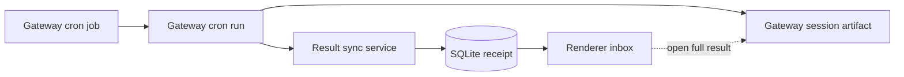

# 定时任务系统

本文按当前 `src/main/scheduler/`、`src/main/ipc/scheduledTask/`、`src/shared/scheduledTask/`、SQLite result store 与 Renderer 页面重写。系统使用 OpenClaw 原生 cron；JustDo 不是第二个调度器。

## 1. 双层模型

| 数据                               | 权威                                | 说明                                  |
| ---------------------------------- | ----------------------------------- | ------------------------------------- |
| Job 定义、enabled、next/last state | Gateway `cron.*`                    | JustDo 每次 list/get 映射 wire object |
| Run history 与执行 session         | Gateway `cron.runs`/session         | 可分页、可追溯完整 transcript         |
| 应用内结果、未读、读取时间         | SQLite receipt                      | Gateway run 的本地投影                |
| 结果同步 cursor/watermark          | SQLite KV                           | 保证跨重启 catch-up                   |
| 删除过的本地结果                   | 同步 suppression + artifact cleanup | 防 reconcile 立刻复活                 |

“in-app”是阅读位置，不是 OpenClaw delivery channel。delivery mode 仍只有 `none`、`announce`、`webhook`。

## 2. 领域类型

页面右上角的齿轮打开全局调度设置，在任务和收件箱页签均可使用，与收件箱的显示筛选菜单独立。设置映射到 OpenClaw 原生 `cron.enabled`、`cron.skipMissedJobs` 和 `cron.sessionRetention`；补跑开关与 `skipMissedJobs` 反向对应，一次性任务的补跑不受该项影响。保留期提供 1/7/30/90 天、不自动清理及原生时长语法的自定义输入；`false`（以及原生零时长）仅关闭定时运行会话清理，不改变本地摘要保留或其他归档策略。

`GetSchedulerSettings` 返回有效配置和 `config.get` 的 hash；`UpdateSchedulerSettings` 只接受三个字段的增量 patch 与用户打开设置时的 revision。Main 再次校验时长/开关，提交 `config.patch` 的 `baseHash`，由 Gateway 原子拒绝过期保存；失败保留草稿并允许显式重新加载。配置同步只为缺失字段补齐产品默认 `enabled:true`、`skipMissedJobs:true`、`sessionRetention:'7d'`，即启动补跑默认关闭；保留用户设置及其他 cron 配置，避免重启覆盖。全局暂停时页面显示提示，单个任务的 enabled 状态保持独立。

### 2.1 Schedule

- `at`: ISO 时间字符串；一次性执行。
- `every`: `everyMs` 和可选 `anchorMs`。
- `cron`: 表达式、可选 timezone 和 `staggerMs`。
- `on-exit`: Gateway 监管的进程退出时触发，可带 cwd。
- `stream`: Gateway 监管的长驻命令产生事件批次时触发。

创建/编辑表单只生成 `at/every/cron`。`on-exit/stream` 可以由 OpenClaw CLI、Agent 或其他原生客户端创建，JustDo 会正确展示，但不把它们塞进旧表单做有损编辑。

### 2.2 Payload

- `agentTurn`: message，可选 timeout/model；新建任务默认使用 `main`，也可选择已启用的助手，在该助手的隔离会话中执行。编辑时保留原助手，显式切换助手会清除旧 sessionKey 绑定。
- `systemEvent`: text；通常目标 main session。
- `command`、`script`: v2026.9.2 原生无人值守 payload；JustDo 只读展示，并在手动运行前以精确 argv/脚本文本二次确认。确认请求携带所展示配置的 revision，由 Main 在运行前重新读取并拒绝已变化的任务；这是运行前复核，不是 Gateway 原子 CAS。
- `heartbeat`、`skillCollectionReview`: Gateway 收敛的系统 payload；在 JustDo 中标记为 OpenClaw 管理。JustDo 对主 Agent 显式配置 `heartbeat.every: 0m`，关闭不适用于本产品的周期性外部通知检查；OpenClaw 保留的 disabled heartbeat 行不进入 Renderer 任务列表。对话创建任务直接使用原生 automations/`cron.add`，普通 `agentTurn` 任务由 cron timer 独立调度，不依赖周期 Heartbeat。
- 技能库自动整理由原生 Gateway 按工作区维护，Renderer 聚合为一张全局功能卡片，展开后按助手查看调度、状态、详情与运行历史。开关使用带配置 revision 的 config.patch 修改 `skills.workshop.autonomous.mode`（开启 auto，关闭 off），影响全局技能自动学习与整理；默认补齐 off，保留用户显式的 auto/propose/off。聚合 ID 仅用于展示，不能传入 cron 变更或历史接口。移除原 029 补丁，恢复原生系统任务收敛；已打旧补丁的开发运行时需从锁定的干净包重建。

### 2.3 Delivery 与目标

Delivery 包含 mode、channel、to、accountId、bestEffort。创建表单使用 `main/isolated`；列表还能安全读取 v2026.9.2 的 `current` 与 `session:*` target。wake mode 是 `now` 或 `next-heartbeat`。channel option 可标 disabled，并用 accountId 区分多实例 bot。

Job 映射额外给 Renderer 一个 management 分类：`editable` 是表单可无损 round-trip 的普通任务，`advanced` 可启停/试运行/删除但不进入旧表单，`managed` 是 declaration key 或系统 payload 收敛的任务，只读展示并保留运行历史。owner/account tool policy、pacing、trigger、failure alert、非默认 delete-after-run 和高级 delivery 字段都会把任务归为 advanced，防止基础编辑器覆盖隐藏权限或执行语义。

### 2.4 执行权限

Agent-turn 任务的创建与编辑表单提供“只读”和“完全权限”。新建任务默认只读。Main 同时保存原生 `payload.permissionMode` 与工具白名单：只读为 `read-only` 加检索工具集合；完全权限为 `full` 加 `['*']`。运行时补丁 030 在每次 isolated 会话创建后写入权限模式及工作区根目录，并将模式传给嵌入式执行器；CLI 执行器从会话记录读取同一模式。原生 Full 模式使用 `security: full`、`ask: off`，无需人工审批，不修改全局或助手配置。沙盒和操作系统边界与主界面一致。

只有无 Agent caller scope 的 `operator.admin` 客户端可以设置任务权限；已有 Full 任务的修改和手动执行也要求该身份，避免低权限模型通过改写任务绕过会话权限。手动执行在排队提交及实际执行时重读任务权限，避免等待期间权限变化造成检查过时。定时执行与手动执行共用运行路径。系统任务和非 isolated 任务不能借此修改主会话权限。旧任务仅有通配工具白名单时显示“保留现有自定义权限”，不会自动提权；用户显式选择完全权限后才写入 `full`。新字段由 native cron JSON storage 持久化并纳入配置 revision。部署必须从锁定原始包重建运行时，不能原地修改旧补丁。

`systemEvent` 任务由主会话 heartbeat 执行，原生运行路径不应用任务的 `toolsAllow`，因此表单仅说明其继承主会话权限，不展示权限选择。Main 拒绝对此类型显式设置权限预设；默认只读仅应用于新建 agent-turn 任务。

已有任务不自动修改权限；自定义工具限制显示“保留现有自定义权限”。仅修改名称、提示词或时间时保留原工具限制。权限字段属于 IPC/表单输入，不增加 SQLite 副本或 Gateway 自定义字段。系统管理任务仍只读展示，不开放基础任务编辑器。

### 2.5 记忆整理功能开关

记忆整理卡片的开关通过 Gateway `config.get` 和带 `baseHash` 的 `config.patch` 修改 `plugins.entries.memory-core.config.dreaming.enabled`，不调用 `cron.update`。关闭时插件移除任务；Renderer 根据配置保留功能卡片，便于重新开启。该占位卡不持久化、不进入收件箱、没有运行或历史入口，也不会提交给 cron API。重新开启后由原生插件创建任务并替换占位卡。

不再提供单独的系统任务设置弹窗。技能整理聚合卡片提供全局模式开关，明确说明影响全局自动学习与整理；展开后查看各助手原生任务状态与历史。原生 `skillCollectionReview` 不接受客户端单独修改，系统维护流程不使用普通 agent-turn 的权限预设。

### 2.6 状态

产品状态：success/error/skipped/running；Gateway wire 的 `ok` 映射为 success。TaskState 包含 next/last/running timestamp、last error/duration 和 consecutive errors。Run 另外保存 session id/key、summary、delivery status/error。

## 3. 组件

| 组件                             | 职责                                                                    |
| -------------------------------- | ----------------------------------------------------------------------- |
| `CronJobService`                 | `cron.get/list/add/update/remove/run/runs` 映射、事件投影与低频兜底轮询 |
| `ScheduledTaskResultStore`       | receipt、未读、cursor 分页、baseline/catch-up metadata                  |
| `ScheduledTaskResultSyncService` | baseline、增量/强制 reconcile、durable catch-up、事件                   |
| `OpenClawCronRunCleanupService`  | 删除 result 对应的 session tree、transcript/archive/run log             |
| `cronJobServiceManager`          | 延迟组合 adapter、DB、services 和窗口广播                               |
| IPC handlers                     | 输入 normalize、job/result API、session history resolve                 |
| Renderer slice/UI                | CronView、history、ResultInbox、RunSessionModal                         |

## 4. Job CRUD

`CronJobService` 先 ensure Gateway ready，再调用 RPC。list 使用 `limit=200` 和 offset 遍历全部 job，显式设置 `includeDeliveryPreviews=false`，避免列表/轮询触发逐任务的 delivery target I/O；分页同时校验 `nextOffset` 单调增加和 `snapshotRevision` 一致。get/update/toggle/run 使用 v2026.9.2 原生 `cron.get` 精确读取，不再用模糊 query 扫描。

Create 映射 schedule/payload/delivery；Agent-turn 使用调用方选择的 `agentId`，未指定时默认为 `main`。Update 根据 payload kind 原子调整：

- 转为 agentTurn 时默认 isolated、使用指定助手或 `main`；
- 转为 systemEvent 时清除不再适用的 agent/session key 绑定，显式指定的助手予以保留；
- delivery 显式设 none 时发 `{mode:'none'}`，不是遗漏字段；
- mutation 按 task id 串行，避免 toggle/update/run 互相覆盖。
- update/toggle 将最新 job 的 `configRevision` 作为 `expectedConfigRevision` 发回 Gateway；定义已被 Agent/其他客户端改写时拒绝覆盖，并由 Renderer 重载权威列表。
- declaration key 与 Gateway 系统 payload 任务在 Main 和 Renderer 两层都拒绝修改，避免下一轮 OpenClaw 收敛把 UI 操作覆盖。

新建 job 即使调用方省略 delivery，也必须显式发送 `delivery: {mode:'none'}`。这样应用内结果不会因 OpenClaw 默认 delivery 改变而意外 announce；只有用户明确选择外发模式时才发送 channel/webhook 字段。

## 5. 执行助手与会话隔离

定时任务复用现有 OpenClaw 助手，不创建专用执行身份。新建或转换为 agent-turn 的任务默认使用 `main`，也可以显式选择其他助手；独立会话由 `sessionTarget: isolated` 提供。后台 list/poll、普通 update、toggle 和 manual run 保留原 owner，不改写 `agentId`，不附加完全权限或审批豁免。

模型可见的 `automations` 工具不经过 JustDo IPC，因此受保护的 `automation-permission` extension 在 OpenClaw `before_tool_call` 层读取当前原生 session permission mode：Full 放行，Ask/Auto 要求 one-shot approval，read-only 拒绝。定时执行与交互执行使用相同的原生权限规则，没有基于助手身份或 cron-run session key 的豁免。每次 Gateway 连接都通过 status RPC 验证 policy 已加载，缺失时禁止普通 turn。

## 6. v2026.9.2 Delivery 语义

应用内结果不需要外部 channel，新建 job 仍显式发送 `delivery.mode=none`。v2026.9.2 已把执行 `status/error` 与 `deliveryStatus/deliveryError` 分开，JustDo 直接映射 Gateway 事实，不再用 v2026.6.11 的字符串启发式把 error 改写成 success，也不再在 list 读取路径中偷偷 update job 清 backoff。旧本地 receipt 的展示兼容可以保留，但不能反向改写新 Gateway 定义。

## 7. Polling 与事件

Gateway 启动成功后开始 polling，退出清理先停止 polling。v2026.9.2 的 `cron` event 携带 action、job snapshot 和终态字段；`started` 没有稳定 runId，因此只投影 job `StatusUpdate`，`finished` 才按 runId 投影 `RunUpdate` 并定向同步该 job 的 receipt（不得把单 job 当成权威全量集合）。结构增删改触发 Renderer 权威刷新，`scheduled` 不做全量请求，避免高频 stream 任务形成请求风暴。低频轮询仍负责断线/漏事件兜底；仅已初始化的运行历史缓存接收 live/result upsert，从而在漏掉 finished event 时最终收敛且不会无限积累未查看任务的历史。

`cron.run` 是 enqueue RPC，不代表任务已开始或完成。Main 显式发送 `mode=force`，要求响应包含 `enqueued=true` 与非空 `runId`；UI 只提示“已加入队列”，不伪造 running 历史。未入队、already-running 或缺少 runId 都作为失败返回，最终状态由 Gateway event / `cron.runs` 事实产生。

轮询失败记录 module-prefixed error并等待下轮；不能用空成功列表覆盖 UI，因为启动时事件可能早于 Renderer 订阅。`isCoworkBusy` 可用于降低后台竞争，但不是永远暂停调度的理由。

## 8. Result baseline

首次启用本地结果收件箱时不能把全部历史突然标未读：

1. 记录 `baselineAt`。
2. 全局取最近 200 个 run，每 task 最多 20 个。
3. 作为已知 baseline 写入 receipt/watermark，不产生 new-unread event。
4. 后续只把 baseline 后完成的新 run 作为 unread。

任务不在有限 baseline 窗口时，使用该任务 Gateway `lastRunAtMs` watermark 或 baseline timestamp，防止漏掉下一次运行。

## 9. 增量 reconcile 与 durable catch-up

普通轮询仅处理 lastRun 超过本地 completed-through 的任务。启动/手工刷新先 upsert 有界全局窗口，再按 task 分页向旧方向 catch-up：

- 页面 50；每轮最多收集 100；
- 以 boundary run id、startedAt、stopAt、ignoreKnown、resumeOffset 表达 continuation；
- continuation 持久化，应用重启后继续；
- run 按时间正序 upsert，因此事件和未读语义稳定；
- id 去重，校验 task/run id 和时间；坏数据跳过并记录脱敏警告；
- 已存在 receipt 可更新 summary/status/delivery，但保留已读状态。

同一时刻只允许一个 sync。force reconcile 在当前 sync 后排队；删除期间 reconcile 等待，避免竞态复活。

## 10. Result Store

`scheduled_task_run_receipts` 以 run id 为主键，保存任务名快照、系统任务标记、session、状态、summary/error、delivery、时间、observed/read/updated。列表按 `(started_at DESC, run_id DESC)` keyset cursor 分页，limit 在 IPC 限为 1..100。unread 查询排除 running、系统任务、OpenClaw `NO_REPLY` 成功结果，并仅对系统管理任务的 `heartbeat skipped:*` 做例行心跳降噪；被降噪的结果仍保存在 receipt 中并可由 `includeSystem` / `includeRoutine` 查询。mark read 使用 `COALESCE` 保留第一次阅读时间。

`scheduled_task_result_cleanup` 记录清理过程中归档路径/进度，支持失败重试。Baseline/per-task completed-through/catch-up metadata 位于 KV 的受管 key，不是 Gateway job 定义；completed-through 在导入和删除时单调推进，因此删除最新 receipt 不会让同步水位回退。

## 11. 删除结果

删除不是简单 `DELETE receipt`：

1. 校验 run id，读取 receipt；running 结果拒绝删除。
2. 对该 run 加 suppression，等待在途 sync。
3. Cleanup service 验证 session key属于 cron run，枚举最多 1000 个 session tree。
4. 通过 Gateway 删除 child -> root session/transcript，清 session approval grants。
5. 清 OpenClaw v2026.9.2 `task_runs` 中对应的 cron history row、delivery sidecar 与可选 lifecycle binding，并清理受管 archive artifacts；匹配必须同时约束 cron runtime、job id 和 run identity/时间，路径必须在 state dir。
6. 全部成功后在同一 SQLite transaction 中推进 task completed-through、写 durable run tombstone 并删除 receipt；失败保留 receipt 以便重试。后续启动/强制同步会忽略 tombstoned run，避免 Gateway 延迟写回导致结果复活。
7. 更新 unread count，解除 suppression。

删除 job 不自动等同删除所有已同步结果；两者生命周期独立。

## 12. Session resolve

结果详情先显示 receipt summary；用户打开完整运行时，IPC 用 `scheduledTaskRun` 选项调用 adapter `fetchSessionHistoryByKey`。对于精确的 `agent:<agent>:cron:<job>:run:<sessionId>`，调用 Runtime Services 的 `runtimeServices.scheduledTaskHistory`，由 Gateway 内的原生 SDK 按物理 `sessionId` 找到 transcript 所属 key 并读取可见分支消息，再交给 Renderer chat normalization。原生运行结束会移除 continuation alias，但保留任务主 key 下的历史窗口；`sessions.resolve` 只查当前 entry，不能作为历史窗口查询。禁止简单去掉 `:run:` 再读取任务当前会话，避免串到后续运行。

该 RPC 校验 agent、job、sessionId 的一致性，使用 `operator.admin`，不读取或恢复删除归档，不修改原生数据库。归属检查、消息读取和读后复核统一绑定当前配置的 agent 会话存储路径。响应按 256 Ki 字符分块，SHA-256 版本防止跨块拼接不同快照，不保存额外消息缓存。已完成运行明确返回 `not-found` 或 `empty`，或消息经过显示过滤后为空时，直接展示对应解释；传输失败与运行中暂空才继续重试。非精确 cron-run 会话沿用 `chat.history`、`sessions.resolve` 和 `sessions.get` 路径。

收件箱中的会话标识只表示可发起读取，不证明 transcript 仍然存在。无标识、跳过运行和上次读取失败分别提示；读取失败状态仅保存在当前收件箱组件中，允许重试，读取成功后清除，不缓存消息。重试耗尽不能据此认定记录已删除或仍在同步。来源任务不在当前列表中也不等于会话被删除；任务列表加载中或有错误时不显示该标记。

`NO_REPLY` 只控制是否需要通知，不能证明运行没有 transcript。用户主动打开完整结果时仍读取该次运行的消息；只有没有可读消息时才展示静默完成说明。

重试耗尽的诊断只记录 run id 规范化值、status、session kind、session key SHA-256 前 12 位 fingerprint 和是否有 sessionId，不记录完整 key 或消息内容。

## 13. Renderer

`scheduledTaskSlice` 保存 tasks、runs、Gateway nextOffset、result pages/unread 等共享状态。`CronView` 管理 create/edit/toggle/manual run，并给 advanced/managed job 明确徽标和受限动作；高级与系统任务提供只读详情，展示 schedule/payload/session/delivery 及不会进入基础编辑器的原生能力。command/script 手动运行前必须二次确认。`TaskRunHistory` 展示加载/失败反馈并防止同一 cursor 重复请求；`ResultInbox` 默认只显示用户任务中有内容或需要处理的结果，支持未读、任务、分页、标记和删除，齿轮设置可按需显示系统任务或例行记录且偏好保存在 Renderer 本地；`RunSessionModal` 复用 chat pipeline 展示完整历史。

编辑普通任务时必须保留表单未暴露但 Gateway 已有的 agent-turn model/timeout/fallback/toolsAllow 等字段、cron timezone/stagger 和 announce target/account/bestEffort，不能因为只改名称或提示词而清空原生配置。

事件订阅后仍需主动首次 list/results，不能依赖可能已错过的 startup refresh。optimistic toggle/run 应以 handler 返回或下次权威 list 回正。

## 14. IPC

Job：List/Get/Create/Update/Delete/Toggle/RunManually/ListRuns/ResolveSession/ListChannels。RunManually 返回 enqueue receipt，ListRuns 透传 Gateway 的 `hasMore/nextOffset`，不能再用“页长等于 limit”猜测下一页。事件：StatusUpdate/RunUpdate/Refresh。Result：ListResults/MarkResultRead/MarkAllResultsRead/DeleteResult/ReconcileResults，以及 ResultUpserted/UnreadCountChanged。

结果收件箱 IPC 对 run id/taskId 做规范化并校验 limit/cursor；原生 cron job id 保持精确值交给 Gateway 校验，run-history 分页边界由 Gateway schema 限制。失败对 Renderer 返回稳定通用信息，详细内部错误只进日志且不能含 prompt/credential。

## 15. 失败处理

| 故障                        | 行为                                                |
| --------------------------- | --------------------------------------------------- |
| Gateway 未 ready            | handler 等待 ensureReady 或返回失败，不返回空成功   |
| list pagination cursor 异常 | 终止并报错，防无限循环                              |
| reconcile 某批失败          | 恢复批前 continuation，下次从同边界重试             |
| artifact cleanup 失败       | 保留 receipt，不产生“已删除”假象                    |
| session history 暂不可用    | receipt仍可读；UI重试并做 fingerprint 诊断          |
| job 定义并发变化            | `expectedConfigRevision` 冲突，拒绝覆盖并刷新列表   |
| managed/advanced job        | managed 定义只读，记忆与技能聚合卡片通过原生配置控制全局开关；advanced 禁止表单编辑、保留安全动作 |
| manual run 未入队           | IPC 返回失败，不显示“触发成功”                      |

## 16. 测试与维护

修改 scheduled tasks 必须同步 shared、Main scheduler/IPC、Renderer 和数据文档。测试至少覆盖三类 schedule、payload 转换、assignment、pagination、manual run、polling、baseline、跨多页 catch-up、重启恢复、重复 upsert、read preservation、删除竞态/失败、session tree 安全和 UI 初始查询/事件。Gateway API 变更还需更新 capability matrix 与相关 runtime patch 测试。

## 17. Job 与 Result 是两套生命周期

禁用/删除 job 不等于删除已经产生的 result；删除 receipt 也不改写 job。Result summary 可以在 Gateway artifact 清理前存在，但用户请求删除时必须先完成或记录 artifact cleanup，避免 UI 消失而敏感内容仍遗留。

## 18. Polling 并发与游标

- 同一轮 reconcile 使用稳定分页边界，cursor 无进展或重复必须终止，防止无限循环。
- 批量 upsert 保留已有 `readAt`，重复观察同一 run 不应重新变未读。
- 失败时保存批次前 continuation；不能越过失败页提交更后的 cursor。
- startup baseline 区分“安装前历史”和“离线期间新结果”，durable catch-up 状态跨重启保存。
- poll、手工 refresh 和 Gateway event 可能并发，service 需串行/去重而不是并行覆盖 unread count。

## 19. Unattended 安全不变量

JustDo 创建的 `agentTurn` 任务使用现有助手的独立会话，默认绑定 `main`；外部或 Agent 创建的任务保留原 owner/policy。任务工具权限仍受所选助手和原生执行策略限制；automation mutation 由原生 session mode 门禁，没有专用助手的审批豁免。Webhook/channel delivery 中的 credential 由 Gateway/受管配置处理，receipt/log 只保留脱敏错误。

## 20. 代码与测试地图

| 行为                     | 入口                                                  |
| ------------------------ | ----------------------------------------------------- |
| Cron API mapping         | `src/main/scheduler/cronJobService.ts` 及测试         |
| Service composition      | `src/main/ipc/scheduledTask/cronJobServiceManager.ts` |
| IPC validation           | `src/main/ipc/scheduledTask/handlers.ts` 及测试       |
| Result reconcile         | `scheduledTaskResultSyncService.ts` 及同名测试        |
| Receipt/cleanup schema   | `src/main/data/scheduledTaskResultStore.ts` 及测试    |
| Shared schedule/delivery | `src/shared/scheduledTask/` 及测试                    |
| Renderer state/views     | `features/scheduled-tasks/`、`scheduledTaskSlice.ts`  |

## 21. 变更完成条件

表单支持的新 cron 字段必须从 shared type 到 Gateway mapping、create/update/read-back、UI edit 和测试全链路对称；只读取的新版本字段必须显式进入 advanced/managed 展示，不能强塞进不支持的编辑器。新增 run status 要更新 result normalize、排序/终态、delivery error 和展示。任何 polling 优化必须验证跨多页、重启、重复事件和 read preservation，不能只测空列表与单页。
