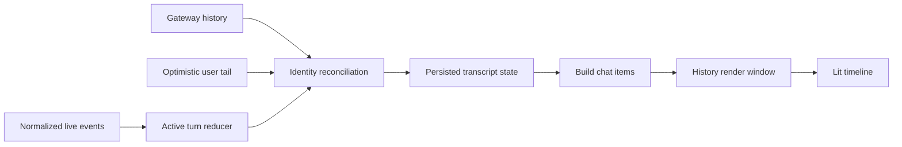

# Chat 渲染架构

操作演示作为独立 Composer 草稿保存在 cowork slice 的 `draftBrowserRecordings`，一份草稿包含多个步骤和有限关键截图。发送时在浏览器不可信上下文中增加长度前缀演示 JSON，图像使用原生附件；历史归一化生成 `browser_recording` 折叠展示块，不新增 transcript cache。文本与图像能力、编辑恢复和数据上限见[浏览器操作演示](../features/browser-operation-recording.md)。

操作演示编辑使用右侧显示区的独立 Tab，不使用模态弹窗。`useRecordingReviewTabs` 接收 Renderer 内的编辑宿主注册事件，按来源会话显示标签；编辑表单通过 portal 挂载到 Tab 内容区域，切换标签不卸载表单。关闭来源或编辑 Tab 时注销宿主，不创建浏览器 guest，也不增加 transcript 状态。

元素详情通过同一展示辅助函数呈现候选定位器及匹配数量、作用域、属性、状态、容器和观察结果；React 与 Lit 均使用转义文本。长演示可以用 targets/targetRef 去重，历史解析先还原目标再展示。发送预算造成的可选详情省略必须显示限制提示，不能把缺失片段当作完整快照。修改输入值会同步当前目标状态并移除旧截图和旧观察证据，避免新旧值互相矛盾。

已完成的 assistant 消息组在所选朗读服务可用时显示右下角朗读入口。本地模式使用按需下载的 sherpa-onnx 模型；在线模式通过 Gateway 原生 `tts.status` 与 `tts.speak` 使用配置好的内网语音服务，Renderer 只接收内联音频，不接触服务凭据。
组件通过 OpenClaw Gateway 的 `tts.speak` 获取音频，播放状态只保存在自定义元素内，
不会把生成的音频写入 transcript 或 Redux。资源和 provider 生命周期见
[`docs/features/local-tts.md`](../features/local-tts.md)。
语音设置页的朗读效果测试通过受限 Main IPC 调用同一个 `tts.speak` 方法，Renderer
仅提交最多 500 字的试听文本并接收内联音频，因此试听与消息朗读使用相同 provider，
也不会暴露在线服务凭据。
输入区的麦克风在 Renderer 录音并编码单声道 WAV，由 Main 调用本地 Whisper
CLI 转写；返回文本只写入可编辑 draft，不会自动发送消息。

浏览器工作区的标注也是 Composer draft，而不是独立 transcript。每个 session id（首页使用 `__home__`）在 cowork slice 保存最多 4 份标注；图片总量沿用 20 MB 限制，结构化上下文总长最多 8,000 字符。完成标注后，网页上方显示可编辑评论条：左侧可展开清洗后的 HTML 元素详情，中间录入评论，右侧按当前语音设置显示语音输入及提交动作。评论写入普通用户草稿，不再注入固定提示词。卡片可预览和移除，切换会话不会串用草稿；网页本身始终是可直接操作的嵌入式 Chromium guest，只有检查/画笔/矩形模式启用覆盖 Canvas，切换 Tab、导航或刷新会使尚未加入草稿的覆盖状态失效。截图仅在提交评论时生成。

Cowork 主工作区在桌面宽度下固定为左侧对话、右侧显示区两栏。窗口顶栏只承载拖拽区域和系统窗口控制；下一行由左侧会话标题与操作按钮栏、右侧内容标签栏并列组成。“新建标签页”菜单在已有会话中提供侧边聊天、浏览器和终端：首页仍只提供浏览器和终端。每次创建侧边聊天（或按 `Ctrl+Alt+S`）都会新增一个独立标签，使用当前会话的 OpenClaw `/btw` 能力；各标签分别持有 Renderer 内存消息和 Composer draft，切换会话、关闭标签或关闭应用时丢弃，不进入主 transcript 或 SQLite。侧聊输入复用主 Composer，只隐藏 `/btw` 不支持的附件、斜杠命令、技能和权限入口；用户消息、Gateway 实际返回的 Thinking/Tool/Content 与最终回复通过共享的 `ChatMessageDisplay` 投影，因此沿用主聊天结构与 CSS。浏览器创建新的 guest 页面，终端创建独立 PTY 并以创建时的当前会话工程目录（首页使用当前配置的工作目录）为 cwd。终端是窗口级标签，切换会话时继续运行并保留原 cwd，只有关闭标签或窗口才终止。每个浏览器页面、终端和文件预览都作为右侧标签栏中的独立标签存在；Plan 复用唯一标签，新的 Plan 内容替换该标签中的旧内容，子任务详情也进入同一标签栏。浏览器不再额外渲染内部标签栏，隐藏右侧网页标签时仍保留已挂载的 guest。窗口不足以同时保留可用的对话宽度时，显示区回退为右侧覆盖层。子任务列表只作为会话栏按钮锚定的浮动下拉出现，选择子任务后其消息进入右侧显示区。

“文件”入口和 `Ctrl+P` 在右侧显示区内停靠惰性文件树，不创建标签；已有会话使用会话工程目录，新对话首页使用当前配置的工作目录。首页没有工作目录时不渲染文件入口；工作目录切换后，文件树按新目录重新挂载和读取。没有内容标签时，文件树左侧显示选取提示。Renderer 只向受限 Main IPC 提交会话标识和相对目录，Main 从持久化 session 或当前 Cowork 配置解析权威工程根目录；目录按需读取，拒绝越界与工程内符号链接，但允许工程根本身经符号链接或 Windows junction 指向真实目录。选择可预览文件后复用文件读取/编辑授权流程创建文件预览标签；不支持的类型也创建只读说明标签，提供在文件夹中显示、使用默认应用打开和调用系统“打开方式”的操作，不弹出类型错误 Toast。两种情况下文件树都继续停靠在预览右侧。

本文按 `v2026.8.27` 的 `src/renderer/libs/openclaw-chat/`、`JustDoChatWrapper`、Gateway client 和相关测试重写。Chat 渲染不是“把 messages map 成 DOM”；它是 history、optimistic tail、实时事件、工具生命周期与滚动窗口的确定性投影。

## 1. 目标与不变量

浏览器扩展的 `conversation-overlay` 也消费实时 Gateway 生成事件：Main 按订阅会话转发规范化的 `agent` / `session.tool` / `chat`，不保存新的 transcript。扩展本地打包复用本章的 `agent-event-reducer`，将活动 turn 投影到 side-panel 的 Thinking/Tool 分组及 Markdown 气泡。历史轮询只做权威校准和终态兜底，不能替代实时输出，也不能覆盖更新的 live tail。具体通知契约、订阅生命周期与构建方式见 [浏览器扩展对话](../features/browser-extension-side-chat.md#流式输出)。

附加会话的 `session.tool` 与普通 Agent 事件可能交错到达。工具详情允许按工具调用身份补入较早的 sequence，仍保留每个工具的去重与终态保护；终态后晚到的 start 只能补齐缺失参数，不能覆盖结果、状态或回退工具 sequence。运行活动的 sequence 比较限定在同一 run，补入不回退当前运行活动，新 run 从低 sequence 开始仍正常显示。历史中，用户续跑后的新 assistant run 可将旧 run 缺失结果的工具显示为中断，不伪造执行结果；同一轮中的子助手通知不结束等待中的工具。

- Gateway transcript/history 是持久消息权威。
- 当前 run 的 agent events 进入单一 reducer，不能再维护并行 overlay 状态机。
- sessionId、sessionKey、runId、lifecycleGeneration、sequence 和 stable message identity共同防串线。
- history/live/optimistic可对账并被替换，不靠文本相同或时间邻近去重。
- 高频delta最多每animation frame发布，长历史只渲染有界窗口。
- Markdown/diagram/tool输出是未可信内容，必须转义和清洗；性能降级不能裁剪canonical文本。
- 用户上滚后保持阅读锚点；新消息不强制抢焦点。

## 2. 模块地图

| 目录/文件                                | 职责                                                              |
| ---------------------------------------- | ----------------------------------------------------------------- |
| `JustDoChatWrapper.tsx`                  | React/Cowork与Lit chat的桥、Gateway订阅、session切换、history载入 |
| `SideChatPanel.tsx`                      | 临时 `/btw` 问答、独立输入和完整实时时间线展示                    |
| `gateway/client.ts`                      | Renderer Gateway client与连接信息适配                             |
| `gateway/chat-controller.ts`             | 对外状态/命令、订阅与transcript调度                               |
| `gateway/chat-history-protocol.ts`       | 原生offset分页、结构化超大行识别与完整消息补取                    |
| `model/chat-transcript-state.ts`         | persisted/history source、active turn、recent runs、revision      |
| `model/agent-event-reducer.ts`           | normalized agent event -> turn items                              |
| `model/session-message-apply.ts`         | durable append identity、ownership、去重与有序插入                |
| `model/history-reconciler.ts`            | history与active/optimistic identity对账                           |
| `model/history-window.ts`                | 750条窗口、每次250条前后移动                                      |
| `pipeline/build-chat-items.ts`           | 原始message -> group/timeline display items                       |
| `components/justdo-chat.ts`              | Lit组件、搜索、minimap、timeline、滚动、Mermaid后处理             |
| `components/markdown.ts`                 | Markdown-it、highlight、KaTeX、DOMPurify、stream边界/cache        |
| `controllers/assistant-stream-pacer.ts`  | 保留assistant快照边界并按frame平滑揭示                            |
| `controllers/stream-render-scheduler.ts` | frame合批和tool partial节流                                       |
| `controllers/chat-scroll-controller.ts`  | follow/paused、锚点、unseen revision、加载旧窗口                  |

## 3. 状态模型

`ChatTranscriptState`：当前 canonical session 的 key/id、persistedMessages、historySource、historyGeneration、activeTurn、recentRuns和revision。History source只有 `gateway` 或 `optimistic`：前者来自权威 history，后者是提交后等待 Gateway 接管的短暂用户尾部。Main/SQLite 不提供降级 transcript。

Plan mode 的规划与实施共用一个 canonical Gateway transcript。批准后 OpenClaw 在同一 transcript 写入 reset boundary；Patch 022 让 JustDo session 的 display-history 投影跨该 boundary，Renderer 因此继续通过普通 `chat.history` 分页读取完整可见历史，而 model-context 投影仍只从最新 boundary 后开始。搜索、导出、滚动锚点、会话复制和用量统计都沿用普通会话路径，不需要 Renderer 拼接多份 transcript，也不需要 SQLite 保存消息或 segment 血缘。

`AssistantTurn`绑定 run/session/lifecycle generation，状态 `running|final|aborted|error`，保存 last agent seq、时间、modelRef和有序items。Item分：

- Thinking：running/completed/failed/cancelled/interrupted；
- Tool：toolCallId/name/input/output/error与同样process status；
- Content：streaming/completed/interrupted，标记 delta/snapshot/replaceable；
- Terminal：aborted/error可见行。

最近24个run保留5分钟terminal/sequence fence，阻止迟到事件重新创建已结束turn。实时Tool结果保留完整canonical字符串；折叠detail和有界history DOM控制渲染成本，不再通过截断数据控制成本。

## 4. 端到端数据流

回复页脚的模型来自 Gateway 本轮 progress / final 消息和当前用户轮次的原生历史。
Main 的 `SessionRunTiming` 只决定开始、结束与状态；旧记录中发送前保存的
`modelRef` 不是实际执行证据，不能覆盖 Renderer 本轮的模型。运行中切换或 fallback
后，final 消息的模型优先于之前的 progress 模型，并随 Renderer turn timing 保留。
Gateway 分开的 provider/model 字段中，model 本身可以带 `/`，组装引用时必须保留 provider。
即使 model 自带与 provider 相同的前缀也不能去重，例如 `openrouter` 与
`openrouter/auto` 组成 `openrouter/openrouter/auto`。页脚查找当前轮次历史时应包含
尚未持久化的本地用户消息，避免在新轮开始时读取上一轮的回复模型。

Wrapper切换session时取消旧订阅、建立新generation、请求Gateway原生history/tool inputs/compaction detail，并设置chat element属性。Controller按session缓存未完成turn、pending user message、run activity和compaction状态；后台session的live/terminal事件及迟到的send/compact RPC结果写回所属缓存，重新选中时先恢复缓存再与history对账。

侧边聊天走同一 Renderer Gateway 连接，但使用独立的 run id 集合和内存 transcript。发送只调用 `chat.send` 并加上 `/btw` 前缀，不创建主会话 optimistic user tail、active turn 或 Main run receipt；Controller 将本连接发起的同一 run 的 `agent`、`session.tool` 与 `chat` 事件归约到独立 transcript，并把 Gateway 实际提供的 Thinking、Tool 和 Content 交给共享时间线渲染。`chat.side_result` 提供最终回复并清理临时 active turn；这些事件都会在进入主 transcript reducer 前被消费，因此不会触发主消息、运行状态或 history 刷新。JustDo 不补造 OpenClaw 未返回的过程事件；外部客户端或其他会话的 side result 一律忽略。

临时session转为canonical session必须由创建流程显式登记准确的source/target key。普通的“临时session → 其他已有session”导航不能推断为promotion，也不能迁移消息或sending状态。Live事件先经过shared domain分类，再送controller/reducer；完整final由后续`session.message`直接接管；无消息、带结构化截断标记、订阅未建立或已有持久化失效通知的final继续做有界补查。旧异步history请求即使晚返回，也因generation/session identity/active leaf fence被丢弃。

Gateway外层event sequence只属于单个WebSocket generation；每次连接都清空基线。发现向前缺口时当前socket立即退休，不消费缺口后的可疑帧，重连后重新订阅并加载history。Agent `payload.seq` 只提供run内顺序与去重栅栏，并不保证连续：累积Thinking/Content快照以及其他可替换高频事件可能被Gateway合并或因慢订阅者背压而丢弃，合法跳号不能触发断线。

`chat.startup` / `chat.history` 返回的 `inFlightRun` 是稀疏状态快照，不是完整事件日志。v2026.9.2原生已实时发送Thinking，但progress snapshot原本保留Tool、preamble和最新usage等状态；运行时补丁017在同一个原生有界快照中保留Thinking/Content分段（含item/preamble正文），并为快照与实时事件提供相同的 `progressSegmentFirstSeq`。模型消息身份、Thinking/Content切换及Tool等原生边界决定分段，正文权威replace不会改变段落身份。`progressSegmentStartedAt`保留段首时间，事件`ts`保留最新更新时间，避免历史Tool前文本的保护规则阻止后续权威修订。快照最多保留50个事件、128 KiB总量、64 KiB单个事件，超限仍依赖Gateway持久history对账，不新增transcript缓存。

Renderer仅回放Thinking、Tool、Content，分别维护实时高水位与快照高水位，并按各个activity owner独立去重。先返回的未来Tool或文本快照不能使仍在传输的中间Thinking失效；迟到事件按序插入，已被更新快照覆盖的同段旧帧不能回滚文本。无序号和消息身份的累计 `inFlightRun.text` 不再注入当前Content，避免多条回复压平或后续单段更新覆盖先前正文。与请求并发发生的terminal或新run会通过run ownership fence拒绝陈旧snapshot。

实时跨通道交错同样使用上述身份约束：带有效 `progressSegmentFirstSeq` 的Thinking/Content，以及带 `itemId` 的preamble，即使被更高序号的Tool或usage先行覆盖run高水位，仍可补入原来的段落位置。前台和后台会话执行相同规则；同一段的旧快照、无可靠身份的旧文本及已结束run的事件继续拒绝，补入不回退run活动状态。

`session.message` 是transcript append的增量权威通知。Controller先按Gateway message id、messageSeq、idempotency、run id和import provenance判断身份与producer ownership；可证明归属的user/current assistant/previous-run assistant立即去重或按seq插入，不再为每一行重载整段history。当前run的durable assistant保留在权威transcript中，但ActiveTurn存在时由显示投影隐藏，避免与流式Content/Tool双显。身份缺失、foreign/queued user、ambiguous assistant、partial import或截断内容仍回退history。

若对应Agent Tool start帧漏收或晚到，Controller还可在session/run identity和active-turn时间边界均匹配时，用稳定toolCallId恢复该append里的缺失Tool；若通知本身也因背压丢失，后续append暴露的messageSeq缺口会登记unresolved target并触发有界active-tail history追赶。只有权威history追到target并经过安全Tool hydration后才清除缺口，陈旧快照或请求失败会重试。恢复不替换整个live timeline，也不推进Agent sequence；每个新恢复Tool先作为live-tail边界，同一权威assistant row会补全并结束Tool前的Thinking。迟到的同轮Thinking帧只能更新已结束项而不能重新点亮；随后canonical start/result或携带同一toolCallId的Tool item按稳定身份确认该卡并校准顺序，无关status/commentary item不能释放边界。

恢复Tool的“结果已知”与“原生Agent序号已确认”独立记录。history结束等待边界时不能把当前run高水位当作Tool的真实首序号；原生Tool事件确认后按真实序号修正位置。assistant消息时间是模型消息开始时间，不能充当Tool执行边界来把迟到Thinking推到Tool后面；已有原生序号优先用于段落归属，只有真正toolResult的完成时间可用于区分完成后的新文本。测试同时检查Thinking到达后、Tool确认前的中间投影和确认后的顺序。

## 5. Event admission

开发诊断：在 PowerShell 设置 `$env:JUSTDO_DEBUG_CHAT_TIMELINE='true'` 后启动 `npm run electron:dev`，开发启动器会映射 Renderer 的 `VITE_DEBUG_CHAT_TIMELINE`。`[ChatTimelineTrace]` 串联 WebSocket 接收（在传输序号过滤之前）、Controller 处理前后、历史/活动投影和已更新的 Thinking/Tool DOM 顺序，Main 转发到日常日志及开发终端。只记录白名单身份、序号、状态、文本长度和 hash，不记录正文、参数、结果或认证帧。每条摘要最多保留80项，Main拒绝超过64 KiB的记录；这是有额外时序开销的显式开发诊断，默认及生产构建均关闭。关闭开关后重启即可停止。收到正常广播的服务端日志不足以证明对应界面已处理或显示该事件，应对照上述阶段定位，再增加现场序列回归测试。

Reducer不只检查runId：

- session key先标准化并与当前域匹配；
- sessionId存在时必须一致；
- lifecycleGeneration防止同run id重用/重连污染；
- agent sequence按run维护单调高水位，并对Thinking/Tool等activity owner维护独立sequence fence；重复或回退的同身份事件忽略，但旧snapshot仍可补入此前未见的另一身份项；
- 新增的非展示stream也推进sequence fence；缺失的持久消息由history/session.message对账，活动文本由后续累计快照或in-flight snapshot接管；
- terminal recent run拒绝后续非合法修正；
- tool terminal status通过shared normalizer统一；
- foreign/detached run只在明确可见规则下形成历史项，不能抢当前active turn。

Main和Renderer共享 `agentEvent`/`messageDomain` 合约，禁止各自维护含义不同的字符串判断。

## 6. Reducer 规则

### 6.1 Thinking

start/delta/snapshot创建或更新独立Thinking item；兼容新版 `data.thinking` 与 `data.text`，文本按delta或snapshot规则合并。终止时变completed/failed/cancelled/interrupted。Thinking不拼入最终Content，也不因没有正文被隐藏。

### 6.2 Tool

用toolCallId稳定更新单卡；input只在详情展示，partial output节流，terminal result/error结束。`sessions_yield` 无输出但仍可显示蓝色running tool，不伪造空result。若其实时start漏收，可由身份受限的 `session.message` 或active-tail history按toolCallId恢复running卡片，并由后续实时事件原位完成；这种missing-item恢复不泛化到普通Tool。若持久化 history 中的 Tool 缺少 result，但其 root run receipt 已是 terminal，history projection 将该 Tool 收敛为 interrupted，不能在应用重启后继续显示呼吸灯。Projection 同时接收 running receipts 做 identity matching，但 running receipt 本身不能提供终态或耗时；同 root 的较新 running receipt 也会阻止旧 terminal receipt 错误结束当前 Tool。`progress_card` 的 Tool item 只投影为紧凑回执；完整卡片由 Renderer 调用 `progressCard.get` 读取，并在 `progressCard.changed` 后按 revision 刷新。

### 6.3 Content

Delta append、snapshot replace、replaceable允许权威final替换。文本merge处理suffix/prefix overlap，避免provider重复快照。final完成流；aborted/error把未完成内容标interrupted并增加terminal item。

运行中的producer-owned `session.message` assistant可以进入persisted transcript，但不能直接写入active Content；显示层在ActiveTurn结束前隐藏同run durable行。Tool及其前置Thinking/Content仍按稳定toolCallId修复活动项，不能让完整持久正文抢占后续流式增量。

Gateway v2026.9.2 原生 required-task join 必须在所有 required child terminal 后才允许父 turn 收敛。Renderer 只消费已获准的 assistant stream 与原生 task terminal event；被 Gateway 延迟或拒绝的 terminal 候选不能作为正文泄漏到 timeline。

### 6.4 Process summary

已完成的Thinking/Tool按时间压缩为process summary，默认不把完整输入/输出塞进主DOM。展开summary后仍按原时序展示；每个Tool有自己的detail disclosure。运行中的Thinking/Tool保持独立可见，不被已归档summary吞并。

原生 `item` 中的 `kind: preamble` 是可见的中间正文：Renderer 直接消费 `progressText`，按 `itemId` 更新同一 Content，`phase: end` 完成该段；Thinking、Tool 和下一条 preamble 仍按原生序号独立排列。它与普通 assistant 正文一样触发即时 stream 通知并参与有界 in-flight 恢复，不能仅安排延迟 history 刷新，否则正文会直到运行结束才成批出现。其他非展示 item 继续沿用各自的状态处理。

`session.message` 的展示投影可能省略原生 commentary，即使其 message id 和 run id 完整，也不表示 Tool 前已显示的 preamble 被撤销。恢复同一 toolCallId 的前置段时，应按顺序合并并保留未被通知覆盖的原生 preamble；完整 history 随后补回正文时一对一复用已有段，保留 UI identity 和原生序号。不能用仅含 Thinking/Tool 的追加通知整片替换已显示的 Thinking/Content，否则正文会短暂出现后消失，直到下一次完整 history 才恢复。

## 7. History reconciliation

最终 history 必须保留原生 assistant 消息内混合 Thinking、Commentary、Tool 块的原始顺序。补丁018只在原生 `includeCommentaryFallbacks` 开启且消息包含 Tool 时，将获准显示的 commentary 按原位置恢复为正文块；不再把独立 commentary fallback 行前置到整条消息之前，否则结束后的历史接管会改变已经正确显示的 Thinking/Tool 次序。恢复沿用原生可见性、清洗和截断规则，不修改持久 transcript 或 provider replay；未启用 commentary recovery 的路径保持原生行为。Renderer 继续消费 Gateway 给出的有序块，不通过文本匹配或时间排序重新推断模型消息顺序。

显式 `display: false` 的消息不生成会丢失该标记的独立 commentary fallback，仍交由原生历史过滤器隐藏。

Stable transcript identity优先读取Gateway message id/记录标识，再用受控fallback。Reconciler：

1. normalize history role/content/tool blocks；
2. 对齐persisted和optimistic user message；
3. 识别active assistant正文是否已进入history；
4. 处理process summary takeover、failed-run message和project turn items；
5. 保留合法active tail，删除已被history覆盖的重复项；
6. 增加historyGeneration/revision。

首屏、切页与应用重启都直接以Gateway history恢复；提交后的optimistic user tail只在当前Controller内短暂存在，权威结果到达后takeover。每次刷新只读取一次`chat.startup`或`chat.history`，首屏和旧页均按250条读取，旧页直接使用响应的`nextOffset`调用`chat.history({ offset, limit: 250 })`。不存在Main IPC、REST或第二份独立快照之间的竞态；重复边界按source identity、projection和出现次数合并，尾页刷新不能让已推进的旧页cursor倒退。持续翻页直到新增可见消息或Gateway明确`hasMore: false`，不能用固定空页次数提前停止。Subagent首屏若尚未包含自己的task边界，会先沿同一原生offset链向前读取，而不是反复请求相同尾页。

同一物理会话运行期间，history响应中的`activeLeafEntryId`变化不能提前清空已显示历史或active turn：该快照仍须遵守active-run reconciliation约束。替换判断在异步消息补取结束、提交前读取当前运行状态；断线恢复的suspended reconciliation也保留running turn，继续确认远端运行状态。保留原leaf基线，等终态刷新可接管时再替换历史；显式reset与物理session identity轮换仍按各自生命周期处理。

Gateway会把超过单行history预算的消息替换为带`__openclaw.truncated`和message id的结构化占位。Renderer不再嗅探`...(truncated)...`文本：先用原生`chat.message.get`补取完整display message；若原生返回`oversized`或响应超过WebSocket frame预算，再调用受保护的`runtimeServices.historyMessage`，按有界字符块从原生SQLite transcript的active branch重组同一message id。Bridge只接受Gateway已经发出的id，不列举消息；一次transfer固定同一份序列化快照，避免逐块重读整个transcript。只有全部块到齐并通过JSON解析后才替换占位，原display identity保留但`truncated/reason`标记被移除。

Tool input lookup先使用原生 `chat.history` display projection，再通过 `runtimeServices.historyDetails` 的 `operator.read` RPC 按 session 和 call id 有界补齐，不能跨 transcript 搜相同 call id，也不能直接读取 `sessions.json`。工具参数与 compaction detail 的缺失 ID 均去重后按最多 250 个分批顺序查询；批次失败保留原始消息与其他成功批次的详情。

## 8. History 窗口

默认只渲染最新750条，older/newer每次移动250。用户在最新窗口时新history继续锁定尾部；浏览旧窗口时用第一条可见stable identity在新数组中重新定位，identity不存在才用索引clamp。窗口切换按滚动方向在距离边缘两个viewport时预取，避免反向误切和用户先撞到边界再等待刷新。

窗口是DOM/投影优化，不限制Gateway分页存储。Controller的chunked history store持有所有已加载页，`chatMessages`只保留最近权威窗口；加载旧页时保留滚动锚点和搜索/minimap identity。异步older返回前若用户转向newer/latest，只按prepend数量平移窗口，不反向覆盖用户意图。滚动期锚点/minimap更新按animation frame合并，并用有序节点的二分定位限制同步layout测量；不能用反复数组前插导致O(n²)组装。

## 9. 渲染管线

`buildChatItems`先 normalize role/message、过滤内部runtime context/heartbeat展示、恢复attachments和tool cards，再分project turns/message groups。Pipeline中的user content、role、stream text、text direction、search match和tool helper保持纯函数。

Timeline层决定avatar、sender/model label、timestamp、duration、usage、goal reply零usage隐藏、process/footer。配置的assistant名称不是模型metadata；真实modelName缺失时使用通用assistant label。

外观设置可在气泡和文档两种消息布局之间切换，默认保持气泡布局以兼容旧配置。文档布局只去除assistant Content的气泡背景与圆角，user Content仍使用右侧气泡，assistant avatar、Thinking、Tool、process summary和附件卡继续保持原有展示与disclosure层级。两种布局都会按消息密度为相邻assistant timeline行保留清晰的垂直间距。该选项只通过继承的CSS custom properties改变展示，不改写Gateway transcript、timeline identity或导出内容。

## 10. Markdown 与安全

`toSanitizedMarkdownHtml` 使用 Markdown-it的linkify/breaks、task list、texmath/KaTeX和自定义fence/table规则，再用DOMPurify tag/attribute allowlist清洗。

完整Markdown解析预算为40,000字符；超过预算时整条消息降级为经过转义和DOMPurify清洗的plaintext，但不丢弃任何字符或首尾空白。cache最多200项且只缓存不超过50,000字符的输入，version为 `markdown-render-v13`。Unknown code language只转义不自动highlight；自动highlight语言是固定allowlist。

链接修正CJK尾随标点但不改显式Markdown link。HTML原文不会直接注入。inline data image仅允许明确image MIME。

## 11. Streaming Markdown

未闭合fence、容器或语法在stream中会造成DOM大幅抖动。`findStableStreamingMarkdownBoundary`只完整解析稳定前缀，尾部以escaped plaintext显示；完成后再全量解析。普通包含box-drawing字符的文本不自动当diagram，只有完整上下边框的独立块才进入diagram展示。

## 12. Mermaid、公式与代码

Mermaid source先以sanitized block进入DOM，component updated后异步render SVG；失败保留syntax error并清临时节点，不展示Mermaid错误画布。Shadow root内使用document-level render后安全注入preview。气泡宽度约束500..820并按SVG调整，支持source/preview切换。

KaTeX由texmath生成且仍经过sanitizer。代码块提供copy按钮；复制来自已解析code文本，不执行内容。

## 13. 滚动

ScrollController只有follow/paused：在底部（0.5px容差）follow并随revision滚到底；用户上滚进入paused并累计unseen revisions。渲染前捕获最多3个可见DOM锚点及offset，渲染/resize后用存活锚恢复位置。

按滚动方向在距上下边缘两个viewport时预取older/newer window，窗口切换期间保持paused。搜索/minimap导航记录target并阻止render anchor和方向预取干扰；“跳到最新”清unseen恢复follow。展开工具/summary前保存interaction anchor，避免高度变化跳屏。

## 14. 渲染调度与性能

Canonical transcript始终立即接收完整assistant snapshot；显示层以canonical文本游标和snapshot结束位置按`requestAnimationFrame`依次揭示，避免provider在同一browser task内突发多个delta时直接跳出整段文本。正常流以24个grapheme为每frame目标并保留provider边界，边界对象上限240；超大重连snapshot按剩余字符和剩余frame自适应提高预算，保证在45 frame内收敛。非prefix权威修订、terminal guard rollback、Tool边界和turn terminal不会继续播放已撤销或越界的旧文本；会话切换返回已有live turn时直接seed当前可见正文，不重播历史。

Stream scheduler负责驱动上述显示节奏；无RAF时在一个microtask内直接收敛，tool partial有独立最小间隔，terminal立即发布当前frame但允许剩余合法正文继续有界追平。Dispose清timer/frame和显示状态。Final追平期间仍按streaming Markdown渲染不完整前缀；若authoritative history先到，component保留该terminal投影直到游标排空，再无缝交给history。该节奏器只改变active Content投影，不修改reducer、history或导出所读的canonical文本；流式期间DOM搜索、复制与`aria-busy`保持和当前可见进度一致，完成态Mermaid增强会等待对应Content追平后再运行。

性能边界包括：有界history DOM、Markdown解析预算与cache、超长Markdown的完整plaintext降级、collapsed detail不入DOM、persisted timeline/render cache、minimap最少2项才显示。任何新投影应避免每个token重新扫描全部history或JSON stringify大对象作为key；不能用裁剪canonical Thinking/Tool/Content代替渲染优化。

## 15. 搜索与 Minimap

搜索收集shadow DOM text nodes，跳过不应搜索的控件，标记match并展开包含它的summary/tool disclosure；清除时还原文本。Match count通过component event回React modal。

侧边栏的全局会话搜索与当前聊天内 DOM 搜索是两条独立链路。标题由 Renderer 在 Cowork session summary 上即时匹配；用户消息和 assistant Content 通过受控 preload IPC 调用 Gateway `sessions.search`。Main 按 agent 分组、按协议上限分批传入 JustDo session keys；截断批次递归二分后再按会话去重、全局排序，并把命中 key 映射回本地 session id。搜索弹窗使用独立的扁平结果列表，每个会话只显示标题和最多一行最佳消息片段，并直接高亮查询词，不复用侧边栏分组、拖拽或管理菜单。搜索结果不写入 SQLite/Redux，也不逐会话加载 `chat.history`；Gateway 原生 transcript FTS 仍是消息索引权威。首次查询若报告索引正在 reconcile，Renderer 会做有界退避重试；超时、截断或部分 agent 失败会显示可重试的不完整状态，不能伪装成无结果。

Minimap从timeline identity生成entry，追踪当前viewport并支持hover preview/点击导航。DOM anchor使用data-history-key/data-process-id等稳定属性，不以数组index作为跨更新身份。

## 16. Attachments 与路径

用户图片始终作为带原始文件名的结构化 `chat.send.attachments` 发送；Renderer 中的 `supportsImage` 只说明模型能否直接消费图像，不再决定附件是否进入 Gateway。OpenClaw 按实际运行模型能力选择内联图像或受管文件降级，并把两种路径都持久化到 `message.__openclaw.media[]`。小型内联图像当前不保证把原文件名写入 durable media fact，因此历史展示必须允许缺少 `fileName`。发送瞬间使用 data URL 乐观渲染；`session.message` 增量追加、`chat.history` 全量刷新以及应用或 Gateway 重启后的恢复都从该 canonical media fact 重建同一图片。`media://inbound/...` 不能交给本地文件 IPC，也不能由 Vite 页面跨 origin 直接 `fetch` Gateway；Renderer 通过最小 preload IPC 请求 Main，Main 使用当前 Gateway token 和 session 调用 `/__openclaw__/assistant-media`，并从 `agent:<id>:...` 会话键派生多 Agent 所需的 `agentId`，校验 image MIME 与大小后返回 data URL。旧 transcript 的 `MediaPath(s)`、`MediaUrl(s)`、`MediaType(s)` 仍作为只读兼容输入，并保持稀疏数组的位置对齐。媒体 MIME 缺失时允许由 canonical `kind` 或安全扩展名判定图片；明确的非图像 MIME/`kind` 优先于扩展名，且不把 metadata-only 或未知文档误渲染为图片。

附件转换为Gateway content blocks，历史媒体从结构化message提取。OpenClaw 在消息的 `openclawDelivery.mediaUrls` 中记录模型输出的原始 `MEDIA:` 引用；JustDo 保留这个字段并直接生成文件卡片，不依赖 managed `/api/chat/media/outgoing/...` 下载地址。Windows 绝对路径原样用于文件操作，相对路径与当前工作空间目录拼接；白名单扩展名通过 Main 读取真实文件并在可编辑侧边栏打开，本地 HTML 则由 Main 按需启动仅监听 `127.0.0.1` 的随机令牌静态预览，并在右侧隔离浏览器中渲染。预览服务只暴露入口同目录内允许的 Web 资源，拒绝隐藏文件、符号链接和目录越界；同源根路径资源根据 Referer 重定向回对应随机令牌范围，不改写 HTML/JS 正文。所有响应都携带禁止外部连接、表单提交和对象嵌入的隔离 CSP；同源页面生成的 `blob:` 脚本/Worker 与内嵌 `data:` 资源可在该隔离边界内运行，嵌入 guest 仍按绑定令牌拦截其他范围外网络请求与导航，且内部 loopback URL 不写入浏览历史。Renderer 标签保存真实文件根与临时 URL 的映射，地址栏、复制、浏览器标注以及“在外部浏览器中打开”始终映射回对应文件路径；外部浏览器接收规范化 `file:` URL，代理 URL 只用于隔离 guest 加载。用户在地址栏输入 `file:` HTML URL 时也必须先经 Main 校验并转换为同一令牌化预览，不能让 guest 直接读取 `file://`。服务生命周期跟随应用进程。“使用系统工具打开”交给系统关联工具，“打开所在的文件夹”交给系统文件管理器。文件是否存在不影响卡片生成；用户点击时若文件已不存在，操作层显示“文件不存在”。对于已经通过本地媒体根目录、常规文件、符号链接和大小检查的 trusted local MEDIA 文件，无法识别 MIME 时以 `application/octet-stream` 的附件交付；不能借此放宽远程或不可信来源。消息复制遵循 OpenClaw WebChat 的可见 Markdown 语义，不承诺复制已被展示投影移除的原始 `MEDIA:` 指令。Markdown本地路径链接经专门utility转成应用操作；图片保存由Main shell IPC执行。单击消息气泡或 Markdown 中的图片，通过 Renderer 的 `cowork:preview-image` 事件打开右侧图片预览 Tab；工作空间文件树和消息附件中的图片文件通过 `cowork:preview-file` 进入同一图片预览组件。图片 Tab 复用会话级文件 Tab 状态、关闭及保留数量限制，本地路径与 `localfile:` 来源归一化后复用同一 Tab，内联图片按来源去重。图片直接复用已有媒体 URL 加载机制，不进入文本文件读取及编辑授权流程；预览支持滚轮缩放、拖动、双击或按钮复位及右键保存，加载失败时显示本地化提示。Renderer不能直接读 `file://`；`localfile://` 使用需遵守安全文档中的限制。

浏览器标注发送采用 display prompt / gateway prompt 双通道：乐观消息和历史展示保留用户原文，Gateway prompt 在原文前加入采用 OpenClaw `EXTERNAL_UNTRUSTED_CONTENT` 随机边界约定、明确标记为不可信页面报告的结构化上下文。历史正规化识别并移除此前缀，避免内部上下文在重载后显示成用户正文。普通消息总是把合成 PNG 作为图片附件与结构化文本一起发送；模型能力为 false 或未知时仍显示提示，但附件降级由 Gateway 的实际模型能力判断负责。Slash command 不消费标注；Goal awaiting-input 通道当前不支持附件，因此仅发送结构化文本。完成 Goal 后的反馈会建立新 Goal，而 Gateway 将 `message` 直接持久化为 objective，因此该路径同样不消费浏览器标注，标注保留到下一条普通消息，避免内部上下文污染 Goal。失败发送保留草稿，成功时按本次提交的 annotation id 删除，发送期间新加入的标注不受影响。

侧边栏浏览器始终以 Electron `webview` 作为实时、可直接操作的页面表面，不使用 Gateway 截图模拟浏览器交互，也不为 Agent 浏览结果创建第二套浏览器标签。Agent 需要浏览器时，Renderer 自动打开当前会话的常规浏览器标签；受限的本地控制桥把 Agent 的点击、输入、按键和滚动发送到同一个 guest，并把该标签切到前台，因此用户可以随时接管。供模型定位元素的是有界 DOM 文本快照，不是用户交互画面。截图只在用户明确提交标注时于内存中合成并作为该标注的附件，不替换或遮挡正在使用的页面。

用户消息不会把给模型的浏览器上下文直接显示为正文。上下文信封同时携带一份有界、清洗后的显示元数据；发送瞬间与历史重载使用同一投影逻辑，将其恢复为 `browser_annotation` 内容块。消息气泡按原始顺序渲染图片与元素引用卡：卡片默认显示元素标签、可读名称、页面来源和与该标注绑定的用户注释，展开后显示 role、稳定 CSS selector、viewport rect、区域数量和页面标题。显示元数据不包含截图、输入值、Cookie 或完整 DOM，最多恢复 4 份标注。

语音输入同样只写入可编辑 draft，不直接提交消息。离线模式中，Renderer 从选定麦克风、Windows 系统 loopback、两条独立来源或用户选择的媒体文件取得音频，并转换成有大小上限的单声道 PCM16 WAV 分段；Main 只接收 WAV 与白名单模型 ID，调用对应本地 sherpa-onnx 参数布局。会议模式在持续采集时串行转写分段，以时间戳和“我/会议声音”标记插入 draft，避免麦克风与远端播放预先混音后丢失来源。

在线模式与 OpenClaw WebChat 使用同一套 transcription-only Talk 协议：Main 先通过 `talk.catalog` 确认提供商就绪，再创建 `transport: gateway-relay` / `brain: none` 会话；Renderer 把音频转换为 8 kHz G.711 mu-law 并通过受限 IPC 追加，Main 按 Renderer 所有权转发与 `transcriptionSessionId` 匹配的 partial/final `talk.event`。原始音频、识别结果和生成语音均不进入 Redux transcript cache；消息发出后仍由 Gateway transcript 成为唯一持久正文来源。

## 17. Goal、Compaction 与错误

压缩进度消费原生 `agent` compaction stream 和 `session.operation`，包括已切到后台的会话。`end` 中的 `completed: false` 或 `outcome: failed/skipped/aborted` 必须显示对应失败、跳过、取消状态，不能生成成功提示或等待不存在的成功 history marker。存在 `itemId/operationId` 时按操作身份去重并拒绝前一操作的迟到事件；没有身份的连续 start 不用时间窗口猜测是否重复。手动 `sessions.compact` 的 payload `ok: false` 通常是业务失败，但原生 preflight 的 `Already compacted` 与 `Nothing to compact (session too small)` 也是该形状，必须精确识别为无需压缩，其他失败不能被吞掉。原生 1800 秒 watchdog 会随进展重置，并非总执行上限，因此 `sessions.compact` 不再设置前端固定 RPC 总超时，仍由原生 watchdog 和断连拒绝收敛；其他 RPC 保持 90 秒超时。手动请求按连接和本地请求身份隔离，旧请求返回不得覆盖新操作。

压缩成功后从原生 history/checkpoint 查询补齐 summary 与 token 数；自动压缩按 marker 的 `itemId` 精确接管对应本地状态，不能把 transcript entry id 当作 item id，也不能用上一轮迟到 marker 替换下一轮状态。已经确认成功的压缩在临时 history 读取失败时保留成功提示，并有界重试补全。运行时若提供摘要增量则可以展示，但不要求原生 compaction stream 一定发送增量。当前仅展示摘要，不生成指向尚未实现的 checkpoint branch/restore 界面的操作提示。

历史 marker 可以先于原生 `end` 到达：这时只隐藏对应本地卡片，保留操作身份直到终态；若提交后扩展失败，同时保留已提交 marker 和失败诊断。连接中断时清除尚未确认的压缩进度，避免后台失败事件漏收后永久显示“压缩中”，后续由新的原生事件与历史恢复显示。

Goal card 位于 chat 周边，Goal 内容/状态来自 Gateway session row，自动续跑 phase 来自 Main snapshot。卡片生命周期按钮通过最小 preload IPC 提交带 goalId fence 的 structured mutation；start/resume 的 optimistic user text 始终显示用户原文，不展示 transport intent 或历史 follow-up envelope。`usage_limited`、`budget_limited` 使用独立状态文案，token 用量直接显示；elapsed 只在 active 时递增，并冻结在 paused/blocked/limited/complete 的原生时间戳。只要 canonical session 仍有 Goal，Composer 就通知 chat 隐藏普通消息编辑/撤回；Controller 在 `sessions.rewind` 前还会读取 `sessions.describe` 并拒绝 Goal 会话，目标修改、暂停、恢复和清除必须走卡片的 structured mutation。Compaction history detail通过专用IPC读取，timeline展示summary、tokens before/after和recovery progress；不把内部context markers显示给用户。

输入区上下文圆环与 OpenClaw webchat 使用同一会话行口径：初始值取 `chat.history.sessionInfo`，运行中的更新取 `sessions.changed` 以及 transcript-derived `session.message.session`，只在 session 已有 `totalTokens` 且能确定 context limit 时展示；`totalTokensFresh: false` 以 `~` 标记近似值。Controller 按 session identity 与 `updatedAt` 拒绝陈旧 history/event 快照，同时允许压缩后的 token 数下降；显示层把超过窗口的 provider 值限制为 100%。该链路不再维护独立 estimate cache，也不再通过 Main IPC 轮询 `sessions.describe/list`。

长时间无输出提示由active turn clock派生，仅表示等待，不宣告失败。Failed run message必须区分abort、error、transport和tool failure；OpenClaw log hint仅从streaming active content的特定系统尾部移除，普通完成内容中的“Logs”标题保留。

历史失败消息不使用会话级 `lastError` 回填；错误详情优先取消息自身的 `errorMessage`，其次取同一 run 的失败记录。缺少 run identity 时仅允许唯一且完全相同的时间戳匹配，不使用一分钟邻近窗口，避免新一轮失败改写历史错误。匿名失败消息一旦关联失败记录，不再被其他 run 覆盖；补齐错误详情时保留原生消息已有的错误正文。

## 18. 会话操作与导出

编辑与撤回只绑定 canonical transcript 的最后一个持久化 user entry，用户消息 footer 不承载分叉入口。“从此处分支”绑定已完成助手回复，在模型、完成时间和运行时长之后渲染独立图标；只有原生 entry id、成功完成的 run timing 和稳定空闲 history 同时存在时才显示。Plan 尚未发生实施 reset 时 transcript 连续，规划阶段的完整助手回复可分叉；实施 reset 既可由显式 `planImplementation` marker 识别，也可由 reset 前已持久化的 `PresentPlan` 推断，边界出现后 Lit 只给其后的实施阶段助手回复显示分叉。实施刚开始而最后一条可见用户消息仍属于规划阶段时不显示编辑/撤回，Controller 也拒绝任何跨 reset 的 `sessions.rewind`，因为 transcript 回退不会同步回滚 Plan 插件状态、本地 handoff 状态或已经发生的工作区副作用。所有操作在断连、sending、compaction、history load/page load、optimistic message 或缺少原生身份时隐藏。

确认编辑/撤回后 Controller 再次核对最后一条原生 entry identity 和 Plan 边界，再调用 `sessions.rewind`，使旧 history generation、分页窗口和显示缓存失效，并从 `chat.history` 重建当前 branch。助手分叉不恢复用户草稿：Renderer 传递所点助手 entry id，Gateway 在生命周期锁和 SQLite transaction 内原子验证并复制截至该完整回复的 active-path 前缀，新会话以空 composer 打开。来源跳转按助手 entry id 加载 canonical history、滚动并短暂高亮原回复。history 重载失败或用户切换会话都不能丢失源会话草稿；撤回模式不恢复草稿。

导出使用Cowork session presentation与canonical items生成文本/Markdown等产品格式，包含必要角色、时间和内容；不直接dump internal state、token、approval payload或Gateway原始JSON。导出前需完成当前显示history加载范围的产品约定，避免误称“完整”却只导出窗口。

## 19. 测试矩阵

现有测试覆盖 WebSocket generation gap、in-flight run按owner补洞、reducer sequence/terminal/tool/thinking、session.message身份/producer admission/插序/去重、history identity/window/reconcile、optimistic tail、process summary、tool lifecycle/cards、active timeline、漏收 `sessions_yield` start后的直接恢复、messageSeq缺口、陈旧history重试、连续/重复/乱序cursor、foreign/旧/无timestamp拒绝及后续sequence连续性、Markdown/KaTeX/Mermaid、stream scheduler、scroll、minimap和wrapper辅助逻辑。

变更还应覆盖：session快速切换、旧request晚返回、重连generation、foreign run、分页两端、超大Markdown/tool输出、XSS payload、展开锚点、search disclosure、RTL/CJK、无RAF/ResizeObserver、history takeover和导出一致性。

## 20. 维护规则

- 新Gateway event先确认消费边界：聊天数据面更新Renderer normalize/reducer，产品生命周期面才同步Main adapter；不要重新双路投影同一消息。
- 不在component render中修协议；复杂转换放纯函数并测试。
- active状态只经transcript reducer/reconciler变更；durable append只经session-message apply或history reconciler进入persisted状态。
- 调整limit必须以性能profile和内存证据为依据。
- Chat架构变化同步Cowork、thin frontend、capability matrix和相关feature审计。

## 21. Item Identity 规则

History message、live assistant segment、tool lifecycle、thinking、plan 和 process summary 使用不同 identity namespace。相同文本不代表相同 item，时间戳也不能单独唯一。Reconciliation key 应优先使用 Gateway message/run/tool/call identity，并把 session domain 纳入；fallback identity 必须稳定且在测试中覆盖碰撞。

## 22. Terminal 与 Takeover

Terminal event 关闭 active reducer 的本次 run，但 OpenClaw 的两条final广播路径都可能先经过默认8K display projection。结构化截断final不能回退已经完整到达的live Content，也不能取消补全；只有前缀能够证明时才用live段恢复显示，并继续以100/400/1500/3000ms有界退避等待完整durable row。完整final保留optimistic tail，订阅到的producer-owned完整`session.message`按message/run identity原位替换并退休active turn；截断`session.message`只触发补查，不能覆盖完整本地投影。无消息、订阅缺口和`sessions.changed phase: message`失效同样进入补查。每次重试绑定session key/id、run与history generation，并且只把非optimistic、非truncated消息视为追平证据。

## 23. 渲染预算与降级

| 内容            | 控制                             | 降级                             |
| --------------- | -------------------------------- | -------------------------------- |
| History         | 750/250 有界窗口及分块           | 保留锚点，按需加载旧页           |
| Streaming delta | snapshot边界游标、45-frame追赶   | 大快照自适应、终态立即收敛       |
| Markdown        | normalize/cache/解析预算         | 全量escaped plaintext            |
| Mermaid         | source hash/cache/尺寸与错误边界 | 显示源码/错误卡，不执行任意 HTML |
| Highlight/KaTeX | 按块处理与 cache                 | 未识别语言/公式显示安全文本      |
| Tool output     | 摘要卡 + disclosure              | 折叠时不挂detail DOM，数据不裁剪 |

限额是产品行为，调整时要同时评估内存、首屏、搜索范围、导出语义和 accessibility，不只观察单次 benchmark。

## 24. 可访问性与交互不变量

Streaming 更新不应抢走键盘焦点或反复触发 screen reader 整页朗读；tool/plan disclosure 使用可聚焦控件与 `aria-expanded`；搜索/minimap 结果需可键盘导航。自动滚动只在用户仍位于跟随区域时发生，用户向上阅读后新 delta 不应强制拉回底部。

## 25. 代码证据地图

| 行为               | 入口/测试                                                         |
| ------------------ | ----------------------------------------------------------------- |
| Event reducer      | `model/agent-event-reducer.ts` 及测试                             |
| Transcript/history | `chat-transcript-state.ts`、history/window/reconciler tests       |
| Durable append     | `session-message-apply.ts` 及controller集成测试                   |
| Optimistic         | `optimistic-user-message.ts`、`optimistic-history-tail.ts` 及测试 |
| Projection         | `project-history-timeline.ts`、`project-turn-items.ts` 及测试     |
| Item pipeline      | `pipeline/build-chat-items.ts`、normalizer/tool tests             |
| Streaming/scroll   | controllers scheduler/scroll tests                                |
| Search/minimap     | `search-match.ts`、`chat-minimap.ts` 及测试                       |
| Gateway transport  | `gateway/client.ts`、`gateway/chat-controller.ts` 及测试          |

## 26. Chat 变更完成条件

浏览器操作演示的 `browser_recording` item 使用独立 `browser-recording-message` 卡片：默认摘要、展开时间线、每步独立的页面/元素 disclosure。历史图像数量来自截图引用，不要求 Renderer 重建图像或消息缓存。HTML 片段只通过 Lit 文本绑定展示，禁止作为网页 HTML 注入；密码步骤不展示值或目标详情。编辑页与 Lit shadow DOM 共享录制展示辅助函数和 CSS，通过各自主题变量映射保持浅/深色一致；不改变 Gateway 的 transcript 所有权。

新增 item/event 必须同时说明 live 与 history 表达、identity、session/run admission、terminal/takeover、渲染清洗、性能上限、搜索/导出和失败 fallback。至少测试乱序、重复、session 切换、分页、重连和危险内容；只截图证明视觉正常不构成数据流验收。

### 系统消息展示边界

同一用户轮次中连续且文本相同的失败记录仅在最终 timeline 投影中保留一条。明确的不同 runId 或失败记录 ID 不合并；缺少 runId 时，必须在当前快照中见到用户消息边界才合并连续错误。新用户消息、正常回复、工具记录及不同错误都会打断合并；附带工具结果的失败行始终保留。分页缺少用户边界时保守保留匿名失败。去重状态仅存在于单次投影调用，原始消息数组、messageSeq、Gateway transcript、运行状态与重试行为均保持完整。

Gateway 的 display history 会清除 assistant 错误的 errorMessage。历史 hydration 仅对空失败或通用失败提示且有消息 ID 的行，通过 runtimeServices.historyDetails 的 failureMessageIds 批量恢复详情，每批最多 250 个 ID、一次可见 transcript 读取。仅补回经过 OpenClaw 内置敏感信息过滤并限制为 2000 字符的 errorMessage，不复制 diagnostics/errorBody 或替换原消息身份。已有部分回复、工具内容和具体恢复建议不触发读取。详情不可用时保留原提示；不借用其他轮次或当前会话的 lastError。截断行先恢复完整消息，再补充错误详情，最后执行失败消息规范化和展示合并。

Renderer 的 pipeline/system-message-display.ts 统一过滤历史消息、实时 Content 及实时/历史终态错误中的内部日志提示：旧版 Log:/Logs: 行、独立命令行，以及新版完整句子 To view logs, run ... in a terminal.。流式输出仅暂扣末尾匹配的提示前缀，完成后保留不完整或无关文本；实际错误原因和恢复建议不变。规则不依赖模型元数据，因为 Gateway 投影可能省略它；用户及工具正文不经过此过滤。原始 Gateway transcript 和诊断日志不改写。

气泡页脚、活动轮次页脚及会话详情使用共享的 isGatewayInjectedModelRef 判断内部模型标识，覆盖裸名、provider 前缀及大小写变化；气泡显示现有本地化系统消息标签，模型统计隐藏该内部标识。

## 协作空间呈现

空间侧栏以 anchor session 显示一行，主会话和输入框不随节点选择改变。
头部“协作 · 人数”与会话菜单打开右侧现有标签栏的“协作”页。
主会话的子任务列表只查询 main 当前会话派生的 Subagent，不再混入助手成员。Graph 是平级助手的导航入口；助手详情标题栏复用子任务面板，只查询该助手当前任务会话的 Subagent，无任务时隐藏按钮。打开子任务详情时保留实际父会话 ID，并复用现有消息标签；main 列表刷新不会关闭助手的子任务详情。
面板读取路由元数据并以 `CollaborationGraph` 展示有向消息关系。房间列表由 Renderer
单例外部 store 订阅 `sessions-changed`，侧栏、会话列表和详情共享一次原生查询与监听；
面板快照随该 revision 读取，不使用固定时间轮询。
点击边筛选两个助手之间的双向交流，点击节点/消息在同一标签内打开 `CollaborationMemberHistory`，
独立 ChatController 读取原生历史和实时事件，切换/关闭时取消订阅并断开连接。
正文不进入 Main 或 Redux 缓存；当前不提供单条原生 entry 滚动定位。
成员详情在时间线分组之前将可信协作来信投影为 user 角色（保留原始 provenance，不修改原生历史），使右侧来信正确重置左侧连续消息的头像位置。连续本助手消息仅首条显示头像。
成员详情沿用 Graph 的房间成员配色，左侧正文、思考、工具过程和流式输出共用本助手的名称首字头像；右侧来信使用同一配色映射中的发送方头像。主会话继续使用默认头像。

Normalizer 仅在成员详情的显式 peerPerspective 投影中，将带可信
sessions_send（以及旧历史 collaboration_send）provenance 的输入放在右侧并标注来源；
普通主会话在 timeline 投影前隐藏这些内部输入。内部前缀只有在原生投递 id 和来源
完全一致时才会隐藏，原始历史和用户文字保持不变。

协作成员详情使用普通原生会话的 `ChatController` 与共享 `ChatMessageDisplay`，不启用 Subagent 任务边界发现。详情独立订阅历史和实时流，Gateway 重启后刷新连接；搜索成员记录仍保留主会话，并在协作页选择该成员。协作消息来源由原生 provenance 的 sourceSessionKey 解析，包含发送 Agent 身份，避免不同成员的相同正文被合并。

协作连线选择筛选两个助手之间的双向投递，并按发生时间展示完整对话；清除筛选恢复按最近交流倒序排列的全量事件。搜索匹配收发助手名称和已解析的原生消息正文；超过 40 条后使用可变高度虚拟列表。事件显示日期时间、收发助手、发送/回复及投递状态，不推测内容摘要。7 至 12 名成员时，锚点位于中心，其余成员沿扩展椭圆分布并使用更紧凑的节点。图使用整个协作画布，支持滚轮缩放、拖拽平移及双击空白复位。点击投递记录时，成员历史组件只将匹配 deliveryId / idempotencyKey、sessions_send（兼容旧 collaboration_send）原生 provenance 与源 sessionKey 的消息交给共享渲染器；不根据正文猜测身份。当前历史范围缺失的消息显示说明，不用完整目标会话冒充对应消息。节点仍打开完整成员历史。

房间列表首次成功读取仅建立观察基线，之后首次观察到当前任务的新房间自动展开协作页。后台房间及切换会话期间返回的响应不抢焦点；已观察过的房间在同次视图生命周期内不再次自动展开，尊重用户手动关闭。成员执行结束显示空闲，不把执行结束视作业务目标完成。
首次请求失败后，后续成功快照仍可建立基线，恢复自动展开。交流列表将标题和搜索栏放在滚动区域外，虚拟行按投递身份与显示模式缓存高度。正文查询逐批加载，一批失败不会丢弃其他批次的结果；修改搜索文字不重复启动正在进行的查询，切换房间清空该视图状态。

协作成员的 `sessionId` 是应用会话 ID（也是托管 session key 的末段），不等于 OpenClaw 的原生 transcript ID。Gateway 扩展必须通过 `getSessionEntry(sessionKey, latest)` 取得原生 `sessionId` 后查询 receipt 索引；没有原生会话时返回正文不可用，不得以应用 ID 创建或猜测历史归属。正文仍由 `chat.message.get` 应用可见性规则，并校验 receipt 与发送方 provenance。

查看协作关系或单条投递详情时，Renderer 把房间锚点和 delivery id 交给 Main；Main 只接受该房间拥有的投递，再由 collaboration 扩展使用 OpenClaw transcript 的 idempotency 索引把 receipt 解析为原生 entry id，并调用 `chat.message.get` 校验该 entry 仍位于当前可见分支。返回前再次严格匹配 idempotencyKey、原生 provenance 与源 sessionKey。每个请求最多查询 16 条投递，跨轮次关系和搜索按批次加载，不再读取或逐页扫描完整历史。正文不进入 JustDo 数据库或 Redux；同一面板生命周期内只按 delivery id 保留内存缓存，房间变化即清空。查询失败不会冒充空消息。

### 浏览器扩展富内容复用

侧栏的 rich-content 构建入口复用 `normalizeMessage`、`getTranscriptMedia`、操作演示组件及抽出的
`browser-annotation-message`，构建时提供浏览器中英文适配，避免导入 Electron 配置服务。
Main app-server 保留原生历史的展示内容与媒体引用，侧栏负责解析和渲染；Main 不维护消息缓存。
图片通过认证后的 `thread/image` 读取：托管输入和输出图片复用桌面 Gateway 媒体接口及原生会话授权，本地图片按原生历史引用校验读取。侧栏显示与桌面相同的 200px 等比缩略图，
并用浏览器 dialog 提供双击/键盘预览。桌面继续使用原有图片窗口。
