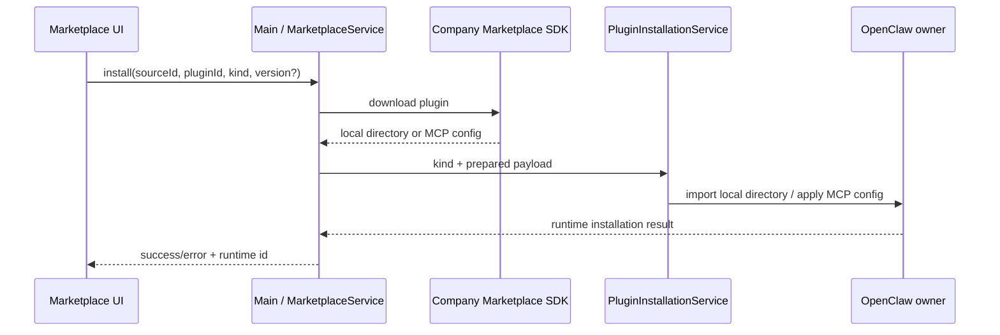

# Plugin Marketplace Adapter

本文描述企业内网插件市场的稳定接入边界。仓库默认不连接任何市场；内网构建注册公司 SDK Provider。

Plugin Hub 的统一页面、权限展示和同名 Skill 交互依据见
[`plugin-hub-experience-plan`](../features/plugin-hub-experience-plan.md)。基础页面和权限 contract
已经实施；本文描述当前 Marketplace adapter contract。

## 1. 支持范围

Marketplace 只暴露当前已经完成安装和管理闭环的三种类型：

- `extension`：公司 SDK 下载的扩展目录，内容由内网市场与 OpenClaw contract 决定；
- `skill`：单个 Skill；
- `mcp`：结构化 MCP server 配置。

公司市场已有的 Agent、Command、CLI 暂不进入 shared contract、IPC 或 Renderer。只有完成
格式转换、安装、启停、更新、卸载和运行时状态对账的完整闭环后，才增加对应 kind。CLI 届时
还应标记为终端能力，因为它不会自然出现在聊天 UI。

根据 OpenClaw 当前兼容 bundle manifest，还可继续评估 Hook、LSP、Rules、Output Style 和
Settings；Prompt、Theme、App 也可列为较低优先级候选。Hook 有独立的生命周期和权限语义，
LSP 有进程与二进制依赖，Settings 会修改宿主配置，均不应在没有专用转换与卸载回滚方案时
直接复用 Skill 安装器。

原生 OpenClaw Extension 能注册 Tool、Channel、模型 Provider、Agent Harness、Memory、语音、
转写、媒体生成/理解、Web Fetch/Search 等大量运行时能力。这些是一个 Extension 内的能力标签，
而不是独立下载单元；市场应继续以 `extension` 安装，并在详情页展示能力清单。

## 2. 安装链路



SDK 负责服务器通信和下载。对于 Extension/Skill，`prepareInstall` 返回下载完成后的本地目录 `sourcePath`；Main 不自行拼下载 URL，也不重复实现 SDK 的认证协议。对于 MCP，返回经过 Provider 映射的结构化配置。

`PluginInstallationService` 只负责按 kind 路由到现有安装器：

- Extension 目录交给共用导入接口中的格式判断与转换入口，不在通用市场层枚举或限制内部内容；
- Skill 目录交给用户 Skill 文件服务；
- MCP 配置交给 MCP 配置服务。

Provider 返回的临时目录可携带 `cleanup`，安装成功或失败后都会调用。

## 3. Provider contract

Provider 实现：

- `source`：稳定的 source id、显示名以及支持的 Marketplace catalog kind；
- `search(query)`：调用 SDK 查询目录；
- `listCategories?(request)`：可选的类别目录，按 source 与 kind 返回稳定 `id` 和显示 `name`；
- `checkUpdates?(request)`：可选的批量更新检查；只有搜索能力的 SDK 可以按已安装 ID
  搜索并比较版本，返回明确标记为 `update-available` 的项目；
- `getDetail?(request)`：可选详情能力；只有“搜索 + 下载”的最小 SDK 不需要实现；
- `prepareInstall(request)`：调用 SDK 下载并返回本地目录，或生成 MCP 配置。

Main 在公开的 source metadata 中投影 `supportsDetail` 和 `supportsCategories`。没有详情能力时，卡片不制造空详情
面板，只保留直接安装动作；该能力判断不要求内网 SDK 增加新接口。

`MarketplacePlugin` 只包含 UI 真正使用的通用元信息。`downloadCount` 和 `category` 是可选展示
字段；`category.id` 必须与 `listCategories` 返回的 id 一致。没有图标时 Renderer 会根据插件 ID
和类型生成稳定的彩色占位图，不要求 Provider 拼接或代理图片地址。

类别只用于空关键词下的“热门推荐”：Renderer 把选中的 `categoryId` 原样传给 `search`，不
根据中文名称猜测或在当前分页做客户端过滤。进入关键词搜索后会隐藏类别并清除类别条件；
类别也不重复显示在普通插件卡片或已安装区域。没有 `listCategories` 的最小 SDK 不显示筛选条，
现有接入不受影响。类别按钮再次点击会取消筛选，避免额外增加一个重复的“全部”标签。

Provider 可以在搜索结果中返回 `installState: update-available`、`runtimeId`、`version` 和
`installedVersion`。Renderer 会用 `runtimeId`（缺省时使用市场 `id`）与当前运行时清单对账：

- 市场卡片显示可执行的更新动作；
- 对应的已安装 Skill、MCP 或 Extension 卡片同步显示“待更新”状态；
- 更新成功并重新列举运行时清单后，两处状态立即归位为“已安装”；
- 系统管理或内置项目即使与市场 ID 同名，也不会开放市场更新。

市场安装成功后，Main 在 SQLite KV 中持久化 `sourceId`、`marketplacePluginId`、`runtimeId`、
`installedVersion` 和可选 `installPath`。运行时清单仍负责判断插件是否真实存在；该记录只把
当前运行时条目映射回正确的市场和版本。更新检查按 source 分组，只把属于该 Provider 的安装
记录发给它；单 Provider 时允许没有历史记录的旧安装按 runtime id 兼容检查。Skill 删除还会
比对安装路径，删除同名项目 Skill 不会误删 managed Skill 的市场身份。

该回传链路不依赖公司 SDK 类型。未实现 `checkUpdates` 时，Renderer 仍会从当前推荐或搜索
结果同步更新状态；实现后则会在市场加载时独立检查全部可更新的用户安装项，不受热门推荐
数量限制。最小 SDK 适配器只需在能够判断新版本时设置上述通用字段；不能判断时返回空数组，
UI 不会猜测版本或显示虚假的更新提示。

`checkUpdates` 返回的完整候选会保留到 Renderer。即使普通搜索结果没有重复携带
`update-available`，相同 source、catalog id 和 runtime id 的市场卡片仍显示可执行更新动作，
并使用候选版本发起更新。

仓库不规定公司 SDK 的类名、鉴权对象或下载方法签名。这些对象只能存在于 Main/Provider 内部，不能放入 shared contract 或穿过 preload。

## 4. 通用校验

这里的校验是进程边界和类型校验，不是公司服务器的鉴权协议：

- IPC 限制 kind、字符串长度、limit 和 operation；
- Source 必须声明支持请求的 kind；
- catalog/detail 只投影 UI 使用的公开字段；
- prepared payload 的 kind 必须与请求一致；
- prepared payload 一旦返回，其 kind 校验失败也必须执行 Provider cleanup；
- Renderer 不接触 SDK、凭证或下载目录管理；
- 安装完成后以 OpenClaw/本地配置重新列举的状态为准。

安装 IPC 显式投影公开响应，只返回 success、runtime plugin id、restartRequired 和通用错误；
安装路径、阶段、capability review 及 SDK 错误不会穿过 preload。安装提交成功后的清单刷新是
独立阶段：刷新失败只提示状态暂未刷新，不能把已经完成的安装重新标记为失败。

Marketplace 不要求额外的“详情身份 token”或内容白名单。内网 Provider 是受信任安装来源，SDK 下载的 Extension 目录与本地导入共用格式判断与转换入口；原生包原样交给 OpenClaw 校验和安装，非原生包进入尚未实现的转换分支，当前提示并停止安装。用户从磁盘手动导入代码 Extension 时仍遵循 OpenClaw 自身的 capability consent，这不是公司 Marketplace SDK 协议。

## 5. 默认与内网组合

默认 factory 注册空 Provider。UI 始终保留“热门推荐”区：没有 Provider 时显示“未配置
Marketplace”，Provider 的空关键词结果为空时显示空状态。内网版本只需要在 composition root
注入 SDK Provider，不应修改 Renderer 或 IPC 协议。

示意：

```ts
const provider: PluginMarketplaceProvider = {
  source: {
    id: 'company',
    name: 'Company Marketplace',
    supportedKinds: ['extension', 'skill', 'mcp'],
  },
  listCategories: async ({ kind }) =>
    (await companySdk.listCategories(kind)).map(item => ({
      id: item.code,
      name: item.name,
    })),
  search: async query => {
    const result = await companySdk.search({
      keyword: query.query,
      kind: query.kind,
      category: query.categoryId,
      limit: query.limit,
      cursor: query.cursor,
    });
    return {
      items: result.items.map(item => ({
        id: item.id,
        kind: query.kind,
        name: item.name,
        description: item.description,
        downloadCount: item.downloadCount,
        category: item.category
          ? { id: item.category.code, name: item.category.name }
          : undefined,
        sourceId: 'company',
      })),
      nextCursor: result.nextCursor,
    };
  },
  checkUpdates: async ({ kind, installed }) => {
    const results = await Promise.all(
      installed.map(item => companySdk.search({ keyword: item.id, kind })),
    );
    return results.flatMap((result, index) => {
      const installedItem = installed[index];
      const match = result.items.find(item => item.id === installedItem.id);
      return match && isNewerVersion(match.version, installedItem.version)
        ? [{ ...match, kind, installState: 'update-available' }]
        : [];
    });
  },
  prepareInstall: async request => {
    if (request.kind === 'mcp') {
      return { payload: { kind: 'mcp', config: await companySdk.getMcpConfig(request.pluginId) } };
    }
    const download = await companySdk.downloadToDirectory(request.pluginId, request.version);
    return {
      payload: { kind: request.kind, sourcePath: download.directory },
      cleanup: download.cleanup,
    };
  },
};
```

`isNewerVersion` 由内网适配层按公司市场的版本规则实现；通用层不会假设版本一定符合 semver，
也不会仅因两个版本字符串不同就提示更新。

公司 SDK 的搜索结果在 Provider 内映射为 `MarketplacePlugin`。最小映射只需要 `id`、`kind`、`name`、`description` 和 `sourceId`，下载量可映射到 `downloadCount`。SDK 下载方法、临时目录类型和认证信息都停留在 Provider 内部。

## 6. 推荐策略

第一阶段不增加“个性化推荐”接口。Renderer 在统一搜索框为空时仍调用同一个 `search`
contract，并把结果展示为“热门推荐”：

- Provider 保留公司市场的返回顺序；最小实现可让 SDK 按下载量排序；
- UI 展示可选 `downloadCount`，但不在 Renderer 跨分页重排结果；
- 输入关键词后，同一列表自然切换为搜索结果；
- 如果 SDK 不支持空关键词，Provider 可以返回空列表，不影响关键词搜索和安装。

统一搜索由 `PluginsView` 下发，Marketplace 组件不会再渲染第二个搜索框。下载量使用应用当前
语言而非操作系统默认 locale；加载占位向辅助技术暴露 busy/live 状态。

这样推荐、搜索和下载只依赖现有两项 SDK 能力，也不会收集用户对话、任务内容或行为画像。以后公司市场若提供精选榜单，可以在 Provider 内把空关键词映射到该榜单，无需修改 preload、IPC 或 Renderer。

不建议在当前数据条件下做“猜你喜欢”。只有下载量而没有质量、兼容性和用户反馈信号时，复杂的本地打分只会制造伪个性化。优先采用“运营精选 > 同类型热度 > 新发布”的市场侧排序，并保持排序原因可解释。

## 7. 格式兼容边界

企业 Marketplace 当前只声明 Skill、MCP 和 Extension 三种安装 kind。OpenClaw 当前支持
Claude Code、Codex、Cursor 等 bundle/plugin 格式；应用在共用导入接口中先调用
`extensionConversion.prepareExtensionForInstall`，存在 `openclaw.plugin.json` 时按原生格式
原样放行，包括交由 OpenClaw 报告的无效原生 manifest。其他格式进入转换分支；转换尚未实现，
当前提示并停止安装，不准备运行时或执行安装器。通用市场层不枚举包内能力，也不把尚未验证
的能力描述成已兼容。后续将单独设计来源厂商与兼容程度标记（例如原生、兼容、部分兼容）
以及未映射能力提示；在获得权威转换报告前，Renderer 不扫描目录自行推断。

## 8. 验收

通用层测试覆盖：三种 kind、未知/Hook kind 拒绝、类别列举与
筛选、空 Provider、搜索分页、prepared payload 校验、cleanup、SDK 异常脱敏及 IPC 输入边界。

内网 Provider 另外验证：SDK 搜索/详情映射、目录下载失败、下载目录清理、Extension 目录导入、单 Skill 导入、MCP 配置安装/更新，以及安装后重新列举的一致性。
