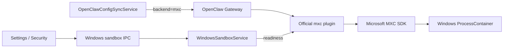

# Windows 原生任务沙盒

本文描述 Windows 上可选的 OpenClaw 命令沙盒。它隔离 Gateway 发起的命令与文件工具，
不替代 Electron Renderer 安全边界，也不限制模型 API、应用内浏览器或 Main 进程本身。

## 1. 安全目标与边界

- 后端固定为 OpenClaw 官方 `mxc` 插件，命令在短生命周期 Windows ProcessContainer 中运行。
- 工作目录可读写；物化后的 skill 副本和系统运行时路径只读；未显式授权的宿主路径不可见。
- 网络策略默认是 `none`；用户可在安全设置中显式允许出站网络，此时配置为 `default`
  并向沙盒授予 `internetClient` capability。MXC 当前不支持域名白名单。
- 每条命令结束时销毁 ProcessContainer，不创建长期存在的 Windows 本地沙盒账号。
- 插件、MXC SDK、IsoEnvBroker 或策略检查缺失时失败关闭，不降级为 host exec。

MXC 通过短生命周期 payload 文件把命令交给 SDK；SDK 0.7.0 最终仍会把请求 envelope 放在
原生进程 argv 中。沙盒命令和环境变量不得携带长期密钥，因为具备进程检查权限的宿主用户
可能在命令运行期间观察到这些数据。

## 2. 组件与数据流



`WindowsSandboxService` 会检查版本锁定的原生二进制 SHA-256、`IsoEnvBroker`，并实际启动一次
无网络的短生命周期 ProcessContainer；任一步失败都不会允许选择沙盒。成功探针按执行器哈希缓存。
系统盘准备状态通过沙盒内实际执行 `dir C:\` 检测，不解析会受系统语言和 MXC capability
SID 变化影响的 `icacls` 显示文本。
系统盘 AppContainer ACE 是兼容性准备项：缺失时沙盒仍可启用，但目录枚举可能失败；用户可以
在设置页显式触发一次带 UAC 的 `wxc-host-prep prepare-system-drive`。提权前和提权后的进程都会
重新验证 helper 的固定 SHA-256 与 Microsoft Authenticode 证书，避免执行被替换的安装文件。

## 3. OpenClaw 配置与 skills

`executionMode` 默认为 `local`。历史 `container` 和 `auto` 值归一化为 `local`。启用
`sandbox` 时生成；本机模式会把 `mxc` 显式设为 `enabled: false`，因此缺少 ProcessContainer 的
机器仍可正常使用本机执行：

```json
{
  "agents": {
    "defaults": {
      "sandbox": {
        "mode": "all",
        "backend": "mxc",
        "scope": "session",
        "workspaceAccess": "rw"
      }
    }
  },
  "plugins": {
    "entries": {
      "mxc": {
        "enabled": true,
        "config": {
          "containment": "processcontainer",
          "network": "none"
        }
      }
    }
  },
  "tools": {
    "exec": { "host": "sandbox" },
    "fs": { "workspaceOnly": true }
  }
}
```

当用户启用“允许沙盒命令联网”时，`network` 改为 `default`；文件系统授权保持不变。

OpenClaw 2026.9.2 的 Docker 风格 skill 投影会把只读 skills 映射回可写工作区之下；Windows
ProcessContainer 无法安全表达这种嵌套权限。JustDo 的版本锁补丁让 MXC 直接使用工作区外的
物化 skill 副本，并对该真实宿主路径授予只读访问。Docker 和 SSH 后端的路径语义不变。

## 4. 构建与发布

`@openclaw/mxc-sandbox@2026.9.2` 作为 Windows 专属预装插件进入 OpenClaw runtime，并携带
锁定的 `@microsoft/mxc-sdk@0.7.0`。构建必须验证：

- 插件和 backend ID 均为 `mxc`，冷启动可通过配置激活；
- `wxc-exec.exe`、`wxc-host-prep.exe`、launcher 和目标架构 `node-pty` 产物完整；
- 原生执行器和提权 helper 匹配版本锁定的 SHA-256 与 Microsoft 签名；
- MXC 外部只读 skill 路径补丁存在且版本精确匹配；
- Windows runtime archive 包含完整插件依赖和第三方许可证。

插件只安装进 Windows runtime；macOS/Linux 构建不会携带或启用 MXC。

## 5. 验证矩阵

- Gateway 冷启动注册 `mxc` backend，插件 disable/restart 正确注销。
- 工作区内创建、修改、删除成功；工作区外读写失败。
- 内置、用户导入和工作区来源 skills 的运行副本可读不可写。
- `read/write/edit/apply_patch/stat/mkdir/rename/remove` 全部走 MXC Windows FS bridge。
- 网络连接失败，子进程继承隔离，超时/取消不残留进程。
- 中文、空格、自定义安装目录和 x64/arm64 路径正确。
- `IsoEnvBroker` 缺失、插件损坏和策略重叠均失败关闭。
