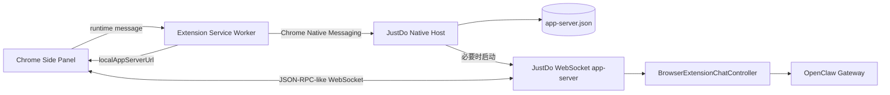

# 浏览器扩展接口文档

本目录是 JustDo Chrome 扩展与桌面应用通信接口的规范入口。实现以 Codex
[app-server wire protocol](https://developers.openai.com/zh-Hans/docs/app-server) 的公开
JSON-RPC v2 形态为基线，并实现侧栏对话所需的兼容子集。Native Messaging 启动协议来自
对本机 ChatGPT 扩展 `1.26.901.11451` 的静态分析，不属于 OpenAI 公开 API。

检查基线：2026-09-18。

## 文档导航

- [Native Messaging 启动与发现协议](./native-messaging.md)：Chrome 到桌面进程的启动、版本协商、rendezvous 文件和消息帧。
- [WebSocket app-server 协议](./app-server.md)：连接、初始化、请求、响应、通知和订阅语义。
- [数据模型](./data-models.md)：Thread、Turn、Item、页面上下文和状态映射。
- [生命周期、错误与恢复](./lifecycle-errors.md)：完整时序、停止生成、断线重连和错误码。
- [兼容性与测试](./compatibility.md)：官方协议边界、JustDo 扩展、当前未实现能力和验收要求。

## 协议分层

两层协议的 framing 不同：

| 层          | 传输                                                 | JSON-RPC 标头                | 用途                                   |
| ----------- | ---------------------------------------------------- | ---------------------------- | -------------------------------------- |
| Native Host | Chrome Native Messaging，4 字节小端长度 + UTF-8 JSON | 必须为 `"jsonrpc":"2.0"`     | 版本协商、确保启动、重启、发现动态地址 |
| app-server  | `ws://127.0.0.1:<port>/app-server?token=<token>`     | 按 Codex app-server 约定省略 | 会话、消息、运行状态与通知             |

## 版本与身份常量

| 名称                 | 当前值                             | 说明                                |
| -------------------- | ---------------------------------- | ----------------------------------- |
| Chrome extension id  | `jboajogplelmaahjbomgflnfngpolgcb` | 由 `manifest.json` 固定公钥稳定派生 |
| Native Host name     | `com.justdo.browserextension`      | Chrome 注册表和扩展必须一致         |
| manifest schema      | `2`                                | Native Host 握手版本                |
| native host protocol | `2`                                | `codexRuntime/*` 方法版本           |
| app-server protocol  | `2`                                | rendezvous 与扩展期望版本           |

协议版本变化必须同步修改桌面端、扩展、测试和本目录文档。新增可选字段可保持当前版本；删除字段、改变字段含义或改变时序需要提升相应协议版本。

## 权威实现

- Native Host：`src/main/browser/browserExtensionNativeMessaging.ts`
- WebSocket server：`src/main/browser/browserExtensionChatServer.ts`
- 业务适配：`src/main/browser/browserExtensionChatController.ts`
- 扩展 bootstrap：`resources/browser-extension/conversation-overlay/modules/app-server-background.js`
- WebSocket client：`resources/browser-extension/conversation-overlay/modules/conversation-client.js`
- Side Panel：`resources/browser-extension/conversation-overlay/sidepanel.js`

文档描述的是当前仓库实现，不承诺未在兼容性表中列出的 Codex app-server 方法。
