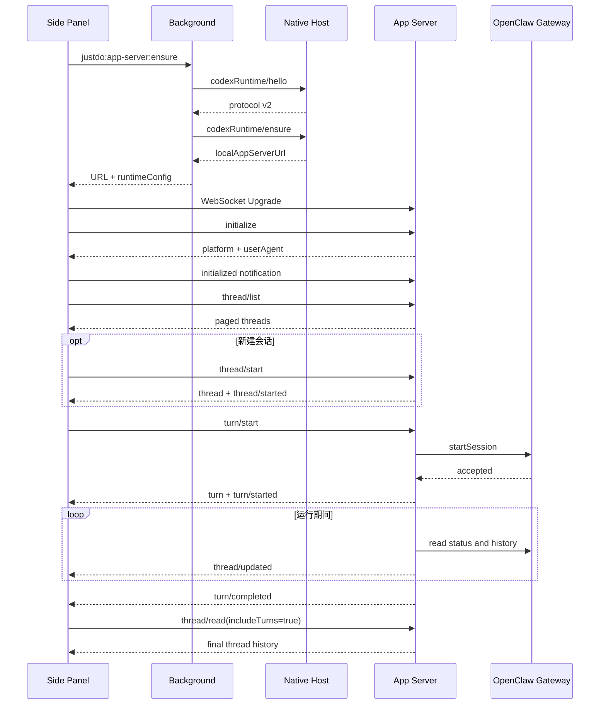

# 生命周期、错误与恢复

## 正常启动与对话

Server 每 500 ms 从 JustDo/OpenClaw 权威状态刷新活动 turn，并以 Gateway runtime 状态而非
可能短暂滞后的持久化 session 状态判断本轮是否仍在运行。此轮询是服务端实现细节，不是
客户端协议保证；客户端只应依据通知和显式读取结果。

## 停止生成

Side Panel 在当前所选线程收到 `turn/started` 后把 Send 按钮切换为 Stop。点击后调用
`turn/interrupt`。Server 会先撤销该线程的本地轮询，再请求路由器停止会话：

- 停止成功：发送状态为 `interrupted` 的 `turn/completed`。
- 停止失败：恢复原 turn 的轮询，并把请求作为错误返回。

## 完成判定

| 条件                                            | `turn/completed.status` | error                            |
| ----------------------------------------------- | ----------------------- | -------------------------------- |
| Gateway runtime 已停止且存在最终 assistant 回复 | `completed`             | `null`                           |
| Gateway runtime 已停止且捕获到本轮错误          | `failed`                | 当前运行的真实 `Error.message`   |
| runtime 已停止、无最终回复且 session 为 `error` | `failed`                | 无真实错误时使用通用失败文案     |
| 连续 3 次找不到 thread                          | `failed`                | `Thread is no longer available.` |
| 连续 120 次刷新抛错                             | `failed`                | `Unable to refresh the thread.`  |
| 用户停止                                        | `interrupted`           | `null`                           |

正常轮询间隔为 500 ms，因此持续刷新异常大约 60 秒后终止；单次异步刷新不会重叠执行。

## WebSocket 错误码

| code     | message 示例                     | 场景                                        |
| -------- | -------------------------------- | ------------------------------------------- |
| `-32700` | `Parse error.`                   | frame 不是合法 JSON                         |
| `-32600` | `Invalid request.`               | payload 不是 object 或缺少 string method    |
| `-32600` | `Already initialized.`           | 同一连接重复调用 initialize                 |
| `-32002` | `Connection is not initialized.` | initialized 前调用其他 request              |
| `-32601` | `Method not found.`              | 未实现的方法                                |
| `-32603` | 具体 Error.message               | 参数缺失、thread 不存在、业务拒绝或内部错误 |

当前参数错误仍统一映射为 `-32603`，尚未细分为 `-32602 Invalid params`。无 `id` 的 notification
发生错误时不会返回响应，符合 JSON-RPC notification 语义。

## 客户端超时

| 通道                                 |  超时 |
| ------------------------------------ | ----: |
| Native Host 单次请求                 | 20 秒 |
| app-server 单次请求                  | 60 秒 |
| Native Host 等待桌面 app-server 启动 | 15 秒 |

超时仅拒绝客户端 Promise，不保证服务端工作已经取消。业务 turn 必须使用 `turn/interrupt`。

## 断线重连

WebSocket 关闭时客户端：

1. 只处理当前 socket 的 close，忽略已经被替换的旧 socket。
2. 拒绝所有 pending 请求。
3. 通知 UI `connection/closed` 并清除 Stop 状态。
4. 1 秒后重新执行 Native Host `hello + ensure`。
5. 连续两次连接尝试失败后，后续尝试改用 `codexRuntime/restart`。
6. 重连成功后发送本地 UI 事件 `connection/reconnected`，重新加载线程与消息。

`connection/closed` 和 `connection/reconnected` 是扩展内部事件，不从 WebSocket server 发出。
每次新连接都必须重新执行 initialize/initialized，订阅也不会跨连接保留。

## 应用退出与重启

- 正常退出：删除属于当前 PID 的 rendezvous，终止所有 WebSocket client，关闭 listener。
- app-server 重启：旧连接断开，端口和 token 都可能变化；客户端必须重新走 Native Host。
- 桌面应用未运行：Native Host 启动可执行程序，轮询 rendezvous，成功后返回地址。
- 桌面应用已运行：第二实例把 restart switch 交给主实例，主实例重新发布 capability。
