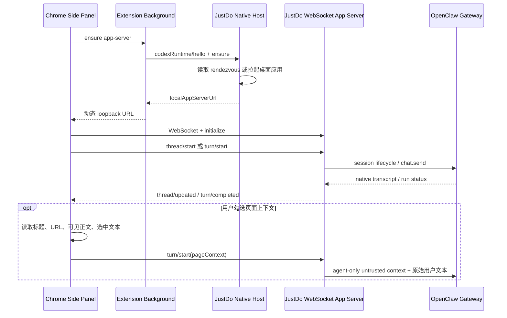
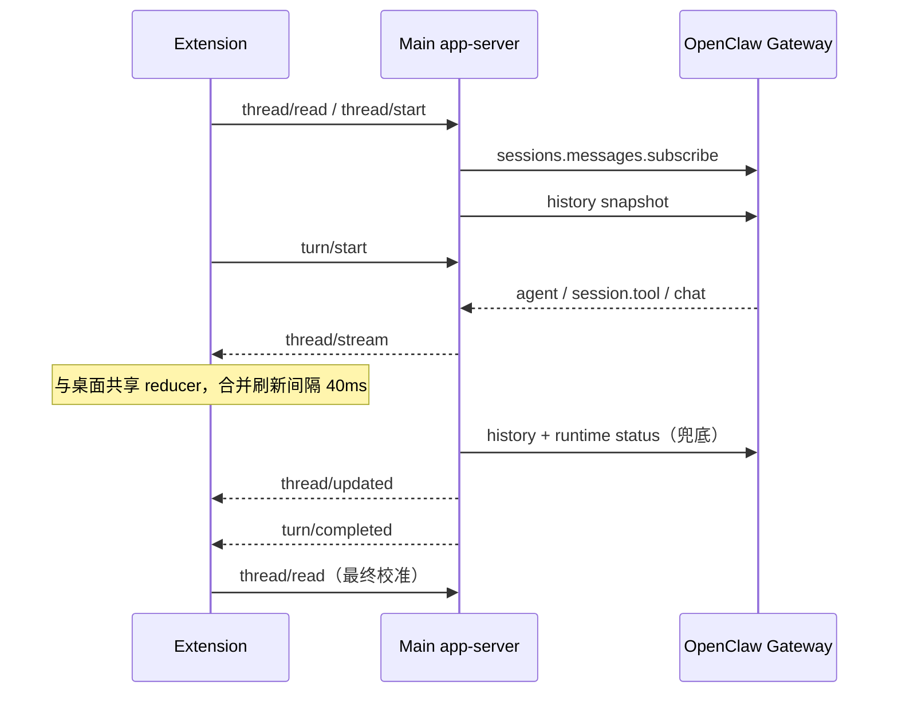

# 浏览器扩展侧栏对话

本文记录 ChatGPT Chrome 扩展的能力调研、在本机已安装扩展 `1.26.901.11451` 中观察到的 Native Messaging 启动边界，以及 JustDo 当前实现。检查日期为 2026-09-20。Codex [app-server wire protocol](https://developers.openai.com/zh-Hans/docs/app-server) 已有公开文档和源码；JustDo 对齐其 v2 请求、响应与通知形态，同时保持自有产品身份。扩展如何通过 Native Host 选择和拉起桌面 runtime 的部分仍以本机版本静态分析为依据。

完整接口规范见 [`docs/browser-extension-api/`](../browser-extension-api/README.md)。本文只保留产品能力、架构决策与后续范围。

## 1. 功能对照

| 能力                                  | ChatGPT 扩展          | JustDo 当前实现                 |
| ------------------------------------- | --------------------- | ------------------------------- |
| 浏览器侧栏对话                        | 支持                  | 支持                            |
| 新建与继续桌面会话                    | 支持                  | 支持                            |
| 当前页面标题、URL、可见正文、选中文本 | 支持                  | 用户显式勾选并授权后支持        |
| 文件附件、权限与模型选择              | 支持                  | 输入区直接选择并作用于下一轮    |
| 停止当前生成                          | 支持                  | 支持                            |
| 桌面端控制已登录浏览器                | 支持                  | 已由 OpenClaw relay 支持        |
| 网站级 allow once/site/all            | 支持                  | OpenClaw Selected tabs/All tabs |
| 右键 Ask ChatGPT                      | 支持                  | 后续阶段                        |
| YouTube 时间戳 transcript             | 支持                  | 后续阶段                        |
| tab mention、书签、下载               | 支持                  | 后续阶段；不扩大当前权限        |
| Chrome 之外浏览器与商店分发           | Edge/Brave/Vivaldi 等 | 当前只验证手动加载 Chrome       |

OpenClaw 自带扩展定位为浏览器自动化基础设施，没有 prompt box、聊天或页面共享 UI。JustDo 保留其 relay 核心，并增加产品会话 side panel。

扩展工具栏入口默认直接打开对话 side panel，不再先显示状态 popup。Side panel 右上角的设置按钮
打开浏览器扩展 options 页面，继续承载 relay 手动配对、All tabs/Selected tabs 和连接管理。
对话输入区采用一体化 composer：上方输入 prompt，下方依次提供附件、权限、模型和发送/停止操作；
页面上下文开关保留在 composer 内。附件、权限和模型均进入真实 app-server/Gateway 流程。
模型下拉框读取与桌面 composer 相同的 `models.list(view: provider-config)` 完整配置目录，并按当前
会话 Agent 获取运行时可选项；当前会话、主 Agent 和其他已启用 Agent 的已存模型只作为 Gateway
启动或重连期间的兜底，不能再把“已分配给 Agent 的模型”误当成完整模型目录。
消息正文使用扩展内置的 `markdown-it` 离线 bundle 渲染；原始 HTML 被禁用，安全链接在外部标签页打开，
不从 CDN 加载脚本。连续 Thinking/Tool 按 `Thinking × M · Tool × N` 分组；历史记录默认折叠，
实时 Thinking 自动展开，Thinking 结束后自动收起。用户手动展开或收起优先，后续同组更新保留选择。
右上角刷新与配对设置统一使用 32px 点击区域、19px SVG 图标，窄侧栏仍同时显示。展开后每个 Tool
仍独立折叠；Tool 折叠行与桌面端保持“状态点 + 工具名 + 单行 Input 摘要”的结构，摘要压缩空白并在
160 字符处截断，完整 Input、Output 或 Error 只在展开后显示。

## 2. 通信架构



这与观察到的 ChatGPT 扩展分层保持一致：Chrome Native Messaging 只承担桌面 runtime 的握手、确保启动和动态地址发现；真正的会话请求及服务端通知走本地 WebSocket app-server。JustDo 对齐当前扩展要求的 Native Host protocol v2 与 app-server protocol v2，并使用相同的 JSON-RPC 2.0 外形和已观察到的方法命名，包括 `codexRuntime/hello|ensure|restart`、`initialize`/`initialized`、`thread/*` 与 `turn/*`。

这不是对 OpenAI 私有协议的完整复刻。JustDo 只实现产品需要且已验证的子集；host 名、extension id、client identity 和业务 payload 属于 JustDo，未观察或未使用的私有方法不会凭空伪造。协议变化需要版本化并更新本文件。

ChatGPT 扩展可先发送轻量 tab 状态，再由 Agent 调用 `getTabContext` 按需读取页面正文。JustDo
当前没有等价的 Gateway 工具回调通道，因此在用户明确勾选并授予网页读取权限后，在发送时采集
最多 24,000 字符的当前页可见正文，与标题、URL 和选中文字一起放入 Agent-only context。它是
有界快照，不是完整页面的按需读取；未来引入工具时应继续保持 transcript 分离。

## 3. 安全边界

- Native Messaging manifest 只允许由仓库固定公钥派生的 JustDo extension id，不能由任意扩展调用。
- Windows 使用独立 Native Host helper 处理 stdin/stdout framing；开发态与安装态共享协议实现，
  Electron GUI 进程不直接充当 Chrome Native Host。
- app-server 仅监听 `127.0.0.1` 随机端口；URL 含每次启动随机生成的 256-bit capability，握手还校验精确 extension Origin。
- Gateway token 与 OpenClaw relay key 不向扩展暴露；手动 pairing 只服务浏览器自动化，与侧栏发现通道分离。
- WebSocket 入站请求上限为 8 MiB；附件最多 5 个且原始文件总量最多 4 MiB，prompt、标题、URL、
  可见正文和选中文本还有领域长度限制。
- 权限与模型在 `composer/options` 返回前保持禁用；从受限模式切换到 Full access 时显示与桌面端
  一致的风险确认。切换会话会清除尚未发送的附件，避免草稿跨会话误发。
- 页面数据可能包含 prompt injection，永远标记为不可信；侧栏提供显式复选框，用户可在发送前关闭页面上下文采集。
- Main 通过仅限已认证本地后台客户端的 `justdoUntrustedContext` 字段传入页面状态；OpenClaw
  只把它加入本轮 Agent 输入，native transcript 仍仅持久化原始用户文本。
- 消息仍由 OpenClaw native SQLite 持久化，JustDo 不增加 transcript cache。

## 4. 当前兼容面与后续

当前 app-server 支持 `initialize`/`initialized` 握手、`thread/list`、`thread/read`、`thread/start`、`thread/unsubscribe`、`composer/options`、`turn/start`、`turn/interrupt`，以及 `thread/started`、`thread/updated`、`thread/stream`、`turn/started`、`turn/completed` 通知。Main 直接转发 Gateway 实时生成事件，历史轮询只负责快照校准和运行结束判定；扩展本身不轮询。

### 流式输出

过去的 500ms 是 Main 查询历史的间隔，不是模型输出推送间隔。尚未持久化的 Thinking、Tool 和正文无法通过历史查询读取，因此可能直到整段生成结束才出现。现在 `thread/read`、`thread/start` 和 `turn/start` 会在历史读取或执行之前建立实时订阅；Main 监听 Runtime 的 `gatewayEvent`，按精确 session key（允许 managed key 的规范别名）过滤，不把子会话事件当作父会话事件。



`thread/stream` 是 JustDo 的 app-server 扩展通知，使用现有 JSON-RPC envelope，**不是声明与 Codex 原生流式通知字段完全兼容**。示例：

```json
{
  "method": "thread/stream",
  "params": {
    "threadId": "local-session-id",
    "kind": "agent",
    "event": {
      "runId": "gateway-run-id",
      "sessionKey": "agent:main:justdo:local-session-id",
      "sessionId": null,
      "lifecycleGeneration": null,
      "agentId": "main",
      "spawnedBy": null,
      "agentSeq": 12,
      "frameSeq": 70,
      "deliveryEvent": "agent",
      "stream": "assistant",
      "timestamp": 1750000000000,
      "data": { "text": "正在增长的累计正文" }
    }
  }
}
```

- `kind: agent` 携带共享 `NormalizedAgentEvent`；`deliveryEvent` 为 `agent` 或 `session.tool`。正文、Thinking、Tool、preamble 使用桌面同一套 reducer，保留快照/增量区别、每轮 sequence 去重、工具状态和 terminal observation 回滚语义。
- `kind: chat` 携带共享 `NormalizedChatEvent`：`runId`、`sessionKey`、`sessionId`、`lifecycleGeneration`、`frameSeq`、`state`、可选 `message`/`deltaText`/`errorMessage` 与 `replace`。Agent 正文已接管时忽略同轮 `chat.delta`，避免双通道重复追加。单次尝试的 `chat.error` 不决定整个产品运行失败，仍由权威 `turn/completed` 显示最终错误。
- 同一 thread 的多个面板共享一份 Gateway 订阅；取消订阅或断开最后一个面板后释放。Gateway 连接重新就绪时恢复订阅。app-server 停止时清理所有监听器；重连后通过 `thread/read` 重建订阅并校准历史。
- Main 不维护新的 transcript cache。扩展只维护最多 8 个会话的临时 UI 投影；持久历史仍由 OpenClaw 管理。运行中旧快照不能回退 live tail；结束后完整历史接管，停止时未落盘的部分文字暂时保留，直到权威历史包含它。
- 历史与实时消息按 Tool 调用身份及工具之间的文字段对齐；中途接入时保留已知工具参数和终态，不因相同文字前缀删除早先工具或正文。控制回复、心跳及通用失败占位按客户端规则过滤，截断的 final 只结束状态、不覆盖完整流式正文。
- 同会话的并发刷新不能相互取消订阅；完成状态由下一次成功的权威历史读取接管，失败刷新保留实时显示。最终快照允许重定位历史压缩后的 turn，避免旧 ordinal 阻止校准；乐观发送到持久化使用稳定显示身份，保留展开状态。
- Markdown 按最多每 40ms 一批更新；不变的消息 DOM 复用。保留用户滚动位置、Thinking/Tool 分组和工具详情的展开状态。正文显示速度受上游真实事件节奏影响，不用逐字动画伪装流式输出。
- 生成的 `modules/sidepanel-stream.js` 来自 `npm run browser-extension:build-stream`，打包浏览器可用的桌面 reducer，不加载 Node/Electron、不从 CDN 拉取代码。修改 reducer 后需重新生成，并运行流式投影、WebSocket 链路和 DOM 回归测试。OpenClaw pairing/relay 基线不参与这些改动。

后续工作包括扩展内的 approval 交互、右键菜单、tab mentions、YouTube transcript、Edge/Brave/Vivaldi 验证，以及 Chrome Web Store 的签名、升级和发布流程；正文、Thinking 与 Tool 的实时输出已实现。打包验收必须覆盖 Native Messaging 注册、应用未启动时的拉起、并发 ensure、断线重连与卸载清理。开发验收还应覆盖动态 Vite 端口写入、工具栏直达对话和设置按钮进入配对页。

### 图片与浏览器卡片

侧栏复用桌面端 `normalizeMessage`、原生媒体元数据读取，以及操作演示和网页标注的 Lit 组件与样式。
用户/助手消息保留展示所需的结构化内容与媒体引用；纯图片消息不会因缺少文字而被丢弃。
Markdown、MEDIA、base64 图片和原生历史附件均显示等比缩略图，双击或键盘 Enter/空格打开图片预览，Esc 关闭。
操作演示保留步骤、页面和元素详情；网页标注保留评论、元素选择器、位置和标注数量，页面 HTML 始终作为文本显示。

图片通过已认证 WebSocket 的 `thread/image` 请求读取：托管输入和输出图片复用桌面的 Gateway 媒体接口，由 Main 解析原生 session key，Gateway 校验会话权限。本地图片每次从该会话原生历史核对引用，
只接受支持的图片扩展名、普通文件及不超过 20 MiB 的内容，拒绝网络文件路径；相对路径按会话工作目录解析。
返回 data URL，不向扩展暴露任意文件读取或额外 HTTP 服务，不增加 Main transcript cache。
网络图片直接加载并禁用 Referer；加载失败显示可读提示。

修改共享解析器或卡片后运行 `npm run browser-extension:build-markdown`，修改流式模型后运行
`npm run browser-extension:build-stream`，再运行 `npm run browser-extension:prepare` 更新开发扩展目录。
生成的 rich-content bundle 使用浏览器语言选择中英文，不依赖 Electron 配置服务。配对/relay 基线保持独立。

### 背景主题

扩展设置页的“对话外观”提供深色、浅色、暖纸色、雾蓝和跟随系统。默认浅色，保留已保存的选择；
选择保存在扩展 `chrome.storage.local` 的 `justdoSidePanelTheme` 中，已打开的侧栏通过
storage change 即时应用，重新打开后恢复。跟随系统会响应系统明暗变化。
背景、正文、Thinking/Tool、输入区、代码块和浏览器卡片共同使用主题色，图片预览保持深色。
设置 UI 与主题模块均位于 `conversation-overlay/`，通过明确构建接入点加入 options 页，
不修改 OpenClaw 的配对/relay 基线，也不与桌面应用主题联动。

富消息投影保留生成图片的 delivery 地址并在每条原生消息末尾只展示一次；纯媒体历史的空 content
和顶层 text 也能保留。原生提醒的 system 投影优先，不因附件恢复内部 user 提示。图片实际加载失败后，
后续历史刷新可重试；多个设置页并发保存主题时，以最新的 storage 变化为准。
