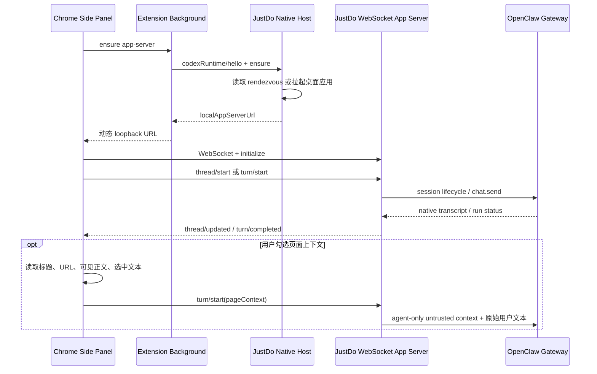

# 浏览器扩展侧栏对话

本文记录 ChatGPT Chrome 扩展的能力调研、在本机已安装扩展 `1.26.901.11451` 中观察到的 Native Messaging 启动边界，以及 JustDo 当前实现。检查日期为 2026-09-20。Codex [app-server wire protocol](https://developers.openai.com/zh-Hans/docs/app-server) 已有公开文档和源码；JustDo 对齐其 v2 请求、响应与通知形态，同时保持自有产品身份。扩展如何通过 Native Host 选择和拉起桌面 runtime 的部分仍以本机版本静态分析为依据。

完整接口规范见 [`docs/browser-extension-api/`](../browser-extension-api/README.md)。本文只保留产品能力、架构决策与后续范围。

## 1. 功能对照

| 能力                                  | ChatGPT 扩展          | JustDo 当前实现                 |
| ------------------------------------- | --------------------- | ------------------------------- |
| 浏览器侧栏对话                        | 支持                  | 支持                            |
| 新建与继续桌面会话                    | 支持                  | 支持                            |
| 当前页面标题、URL、可见正文、选中文本 | 支持                  | 用户显式勾选并授权后支持        |
| 文件附件、权限与模型选择              | 支持                  | 输入区直接选择并作用于下一轮    |
| 停止当前生成                          | 支持                  | 支持                            |
| 桌面端控制已登录浏览器                | 支持                  | 已由 OpenClaw relay 支持        |
| 网站级 allow once/site/all            | 支持                  | OpenClaw Selected tabs/All tabs |
| 右键 Ask ChatGPT                      | 支持                  | 后续阶段                        |
| YouTube 时间戳 transcript             | 支持                  | 后续阶段                        |
| tab mention、书签、下载               | 支持                  | 后续阶段；不扩大当前权限        |
| Chrome 之外浏览器与商店分发           | Edge/Brave/Vivaldi 等 | 当前只验证手动加载 Chrome       |

OpenClaw 自带扩展定位为浏览器自动化基础设施，没有 prompt box、聊天或页面共享 UI。JustDo 保留其 relay 核心，并增加产品会话 side panel。

扩展工具栏入口默认直接打开对话 side panel，不再先显示状态 popup。Side panel 右上角的设置按钮
打开浏览器扩展 options 页面，继续承载 relay 手动配对、All tabs/Selected tabs 和连接管理。
对话输入区采用一体化 composer：上方输入 prompt，下方依次提供附件、权限、模型和发送/停止操作；
页面上下文开关保留在 composer 内。附件、权限和模型均进入真实 app-server/Gateway 流程。
模型下拉框读取与桌面 composer 相同的 `models.list(view: provider-config)` 完整配置目录，并按当前
会话 Agent 获取运行时可选项；当前会话、主 Agent 和其他已启用 Agent 的已存模型只作为 Gateway
启动或重连期间的兜底，不能再把“已分配给 Agent 的模型”误当成完整模型目录。
消息正文使用扩展内置的 `markdown-it` 离线 bundle 渲染；原始 HTML 被禁用，安全链接在外部标签页打开，
不从 CDN 加载脚本。连续 Thinking/Tool 默认压缩成 `Thinking × M · Tool × N`，展开后每个 Tool
仍独立折叠；Tool 折叠行与桌面端保持“状态点 + 工具名 + 单行 Input 摘要”的结构，摘要压缩空白并在
160 字符处截断，完整 Input、Output 或 Error 只在展开后显示。

## 2. 通信架构

这与观察到的 ChatGPT 扩展分层保持一致：Chrome Native Messaging 只承担桌面 runtime 的握手、确保启动和动态地址发现；真正的会话请求及服务端通知走本地 WebSocket app-server。JustDo 对齐当前扩展要求的 Native Host protocol v2 与 app-server protocol v2，并使用相同的 JSON-RPC 2.0 外形和已观察到的方法命名，包括 `codexRuntime/hello|ensure|restart`、`initialize`/`initialized`、`thread/*` 与 `turn/*`。

这不是对 OpenAI 私有协议的完整复刻。JustDo 只实现产品需要且已验证的子集；host 名、extension id、client identity 和业务 payload 属于 JustDo，未观察或未使用的私有方法不会凭空伪造。协议变化需要版本化并更新本文件。

ChatGPT 扩展可先发送轻量 tab 状态，再由 Agent 调用 `getTabContext` 按需读取页面正文。JustDo
当前没有等价的 Gateway 工具回调通道，因此在用户明确勾选并授予网页读取权限后，在发送时采集
最多 24,000 字符的当前页可见正文，与标题、URL 和选中文字一起放入 Agent-only context。它是
有界快照，不是完整页面的按需读取；未来引入工具时应继续保持 transcript 分离。

## 3. 安全边界

- Native Messaging manifest 只允许由仓库固定公钥派生的 JustDo extension id，不能由任意扩展调用。
- Windows 使用独立 Native Host helper 处理 stdin/stdout framing；开发态与安装态共享协议实现，
  Electron GUI 进程不直接充当 Chrome Native Host。
- app-server 仅监听 `127.0.0.1` 随机端口；URL 含每次启动随机生成的 256-bit capability，握手还校验精确 extension Origin。
- Gateway token 与 OpenClaw relay key 不向扩展暴露；手动 pairing 只服务浏览器自动化，与侧栏发现通道分离。
- WebSocket 单消息上限为 8 MiB；附件最多 5 个且原始文件总量最多 4 MiB，prompt、标题、URL、
  可见正文和选中文本还有领域长度限制。
- 权限与模型在 `composer/options` 返回前保持禁用；从受限模式切换到 Full access 时显示与桌面端
  一致的风险确认。切换会话会清除尚未发送的附件，避免草稿跨会话误发。
- 页面数据可能包含 prompt injection，永远标记为不可信；侧栏提供显式复选框，用户可在发送前关闭页面上下文采集。
- Main 通过仅限已认证本地后台客户端的 `justdoUntrustedContext` 字段传入页面状态；OpenClaw
  只把它加入本轮 Agent 输入，native transcript 仍仅持久化原始用户文本。
- 消息仍由 OpenClaw native SQLite 持久化，JustDo 不增加 transcript cache。

## 4. 当前兼容面与后续

当前 app-server 支持 `initialize`/`initialized` 握手、`thread/list`、`thread/read`、`thread/start`、`thread/unsubscribe`、`composer/options`、`turn/start`、`turn/interrupt`，以及 `thread/started`、`thread/updated`、`turn/started`、`turn/completed` 通知。Main 目前从 Gateway 权威状态合成通知；扩展本身不再轮询。

后续工作包括完整的增量 content/tool/approval 事件、右键菜单、tab mentions、YouTube transcript、Edge/Brave/Vivaldi 验证，以及 Chrome Web Store 的签名、升级和发布流程。打包验收必须覆盖 Native Messaging 注册、应用未启动时的拉起、并发 ensure、断线重连与卸载清理。开发验收还应覆盖动态 Vite 端口写入、工具栏直达对话和设置按钮进入配对页。
