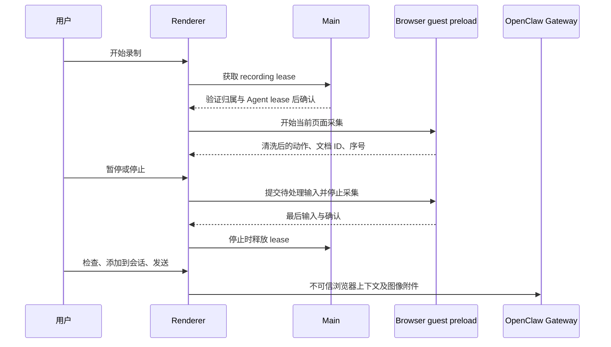

# 浏览器操作演示

侧边栏浏览器的“录制操作”将一次人工演示整理成步骤与关键截图。用户停止后编辑、检查并添加到原会话输入框，再通过普通消息发送。它提供模型参考材料，不训练模型，也不是确定性脚本回放。

## 交互与归属

一次录制绑定会话和 profile。用户可暂停、继续、停止并预览；同 profile 切换页面会保持录制，隐藏面板、切换会话或 profile 自动暂停。暂停仍保留浏览器控制权，恢复时记录未采集区间。停止释放控制权，预览支持改标题、说明、普通输入值、删除步骤与截图；改输入值会删除该步的旧截图。

停止后在右侧显示区打开“操作演示”编辑 Tab，与网页、文件等标签并列，不使用模态弹窗。输入框的演示卡片也通过此 Tab 编辑。切换标签或会话保留未保存的编辑，关闭编辑 Tab 放弃未保存的修改，但不删除原录制或草稿；保存/添加和丢弃仍由显式按钮执行。Tab 仅属于来源会话，不会显示在其他会话。待确认录制由来源 controller 持有，通过 Renderer 内事件注册显示区宿主和 portal；已确认草稿的编辑组件由显示区持有，不随当前输入框卸载，草稿发送、删除或所属会话删除时清理。重复点击来源入口只激活已有编辑页，不重置编辑内容。不创建网页 guest 或新增持久化存储。

编辑页使用紧凑页头、可折叠检查提示和编号步骤卡片；删除/保存/图片操作使用带图标的按钮，窄侧栏保持可访问名称。“页面信息”展示标题和完整 URL；“元素详情”仅在有元素数据时出现，展示元素摘要、角色、选择器与转义 HTML 代码块。页面级动作明确说明不关联元素，旧记录没有 HTML 时不伪造补齐。页头、底部操作区固定，步骤区域独立滚动。发送后的消息默认折叠为演示摘要，展开为步骤时间线，复用同一展示语义和主题样式；截图继续沿用消息附件，不复制存储。

每个会话最多一份待发送演示。正在录制的数据在面板 controller 内存中，确认后的草稿放入已有 cowork slice 的 `draftBrowserRecordings`，不持久化。录制中、暂停及待确认的录制保护其来源会话，不受后台标签页数量限制自动回收；添加或丢弃后恢复普通回收策略。首页转临时/正式会话时显式迁移录制归属，但仍以获取锁时的会话身份释放 Main lease。

发送失败保留草稿，成功仅清除提交时的草稿版本；发送等待期间保存的新修改不会被清除。删除会话释放草稿。关闭应用不会恢复未发送内容。已发送内容仅通过 OpenClaw 原生消息历史保存。

## 数据流与互斥

Main 的 recording lease 与标注锁独立。相同 profile 下 Agent 的 tab/panel 变更操作在申请和获得操作 lease 后都检查录制保护；已有 Agent lease 时启动录制失败，用户重试。只读观察可继续。释放需匹配窗口、会话、profile 和 recording ID；窗口销毁、renderer 崩溃或导航释放保护。Main 不接收步骤、输入值或图像。

guest 在隔离 preload 中被动观察用户事件，不通过页面脚本暴露 Electron 权限。宿主验证录制 ID、来源页面、文档 ID、序号和允许的动作；导航后的旧事件不能进入新文档。暂停/停止等待 IPC 确认，guest 无响应时等待至多一秒后保留已有步骤。

## 采集与限制

编辑页与消息中的动作参数按语义展示：滚动为相对滚动区域左上角的绝对横/纵像素位置（不是滚动距离），按键为键名，选择为选项或选中状态。展开元素详情后直接展示名称、类型、选择器、角色、框架地址和转义 HTML，不再二次折叠；属性与代码使用独立区块，不将精简 HTML 伪装成原网页的完整视觉还原。展示格式不改写发送给模型的原始结构化值。编辑页截图使用紧凑缩略图气泡，右上角仅保留删除图标，不显示截图标题或文字操作栏。双击图片（键盘聚焦后按 Enter/空格）通过现有图片预览事件打开图片预览 Tab；重复打开相同图片复用已有 Tab，不关闭步骤编辑页。

- 支持点击、双击、文本输入、中文输入法、原生选择控件、Enter/Tab/Escape、方向/翻页键及修饰组合键、滚动、右键、原生 HTML 拖放、具有菜单语义且确实展开的悬停，以及页面地址变化与标签页切换/关闭。程序主动派发的输入不作为用户动作；连续输入在字段失焦或结束采集时归并。普通逐字符按键不单独记录；按键包含焦点目标，选择包含 label/value/index，点击包含 CSS 像素位置和元素内偏移，拖放包含源/目标及其作用域。
- 元素保留标签、DOM 推导角色/名称、状态、属性、边界和最多三个语义祖先容器。局部 HTML 最多 4,800 字符、40 个节点、3 层子节点，排除脚本、样式和密码子树，不拷贝 live input value（普通输入状态单独记录）；截断时保留完整标签并标记原因。编辑及历史消息都只以转义文本显示，不执行网页内容。
- 最多八个候选定位器覆盖测试属性、ID、属性/类组合、DOM 推导 role/name、label、文本和结构兜底；CSS 在所属 root 内验证命中及匹配数，超过长度上限的选择器整体舍弃，不截成残缺 CSS。疑似动态 ID 单独标记。语义候选不是完整浏览器 AX 树，匹配数只代表采集时 DOM；执行必须重新验证。最多十二层 frame/开放 Shadow 宿主路径按外到内保存，每层 CSS 相对上一层 root。动态出现的可访问 root 在录制期间补充监听，composed 事件不重复记录。
- 点击/按键后最多观察 450ms 内的 URL、目标状态及可见 alert/status/dialog/menu 文本变化，作为原步骤的补充证据，不增加虚假操作步骤，不证明因果关系；下次动作及暂停前结束观察，导航后不借用新文档的结果。悬停仅在有菜单语义且观察到展开变化时记录；原生拖放仅在 drop 完成后记录，取消拖动不产生步骤。Canvas 内部、自定义指针拖拽、系统菜单内部和跨域框架仍不能保证完整采集。
- 同源 iframe、开放 Shadow DOM 的可访问事件可采集；跨域 iframe、canvas、关闭的 Shadow DOM、复杂拖拽、系统对话框并非完整支持。预览明确提示用户补充遗漏说明。
- 普通输入值最多 2,000 字符。按用户选择仅隐藏可识别的密码字段；验证码、Token、支付字段等保留。已识别的密码框切换为明文后仍不记录其值。URL 保留普通查询和 fragment，只去除 URL 密码及具名密码参数。不采集 Cookie、请求头或剪贴板；发送前需要检查非密码隐私。
- 截图在点击、选择、输入、按键及页面变化后延迟采集，校验当前文档与页面；iframe、canvas、视频、自定义元素、普通表单不再导致整页拒绝。有可见且可识别的密码字段时跳过截图，隐藏登录框不阻止截图。同源 iframe 和开放 shadow root 内的密码也参与检查；跨域 iframe、closed shadow root、图片或普通文字中的密码无法保证识别。观察器只用密码相关变更使正在采集的截图失效，普通广告/动画更新不再让截图失败。观察器仅在采集中启用，暂停/停止断开。编辑页逐步展示密码、超时、页面变化、图像处理失败或预算耗尽的原因，不写入原始页面内容日志。
- 图片仍为网页可视区域截图，并非全页长图或元素局部裁剪；精简 HTML/选择器独立随步骤发送。长 URL 默认收起，可展开查看完整地址；新页面尚未取得标题时不沿用前一页标题。
- 最长 30 分钟、最多 200 步；序列化上下文最多 64,000 字符。超过 48,000 字符时使用顶层 targets 表和步骤 targetRef 去重；仍超限时优先省略 HTML、属性及祖先摘要，保留动作、定位器及状态，并在编辑页提示和历史详情标记 context-budget。仍不能装入时沿用停止/发送阻止机制，不静默丢步骤。历史解析支持原有内联 target 及新的引用形式。
- 最多 12 张 JPEG，长边 1280 像素，图像预算 10 MB；达到预算继续录步骤。与其他附件发送时合计不得超过 20 MB。

## 会话集成

演示与页面标注使用独立类型。外部上下文内使用长度前缀保存演示 JSON，原标注格式及其 8,000 字符上限不变。历史投影生成 `browser_recording` 展示块，使用转义文本和折叠步骤列表；图像沿用 Gateway 附件。

发送前将录制 JSON 内的不可见控制/格式字符转成 JSON Unicode 转义，转义后再计算长度和预算，解析后保留原值而非脱敏。历史恢复保留步骤相对时间、截图引用与指纹；预显示合并除正文外还比较稳定步骤身份，避免不同的纯演示消息都因空正文而被误认作同一次发送。

历史解析允许结束边界后直接 EOF（无附加文字的消息可能被 trim）。对于仅含演示、标注数组为空的历史消息，若文本清洗使长度头失效，仅在完整单行 JSON、固定空标注尾部、匹配的边界 ID、内外长度差一致且声明长度未超限时恢复；任意多行页面标注上下文仍严格按长度解析。恢复仅影响展示，不改写原生历史。

截图发送顺序按步骤排列，不依赖异步截图完成顺序。结构化上下文保存图片内容指纹，恢复编辑时精确关联原图；指纹仅用于内容匹配，不用于安全认证。缺图不猜测或借用普通/标注附件，而是保留可恢复数据并标记不完整。原生历史编辑重发沿用普通发送的模型图片能力与 20 MB 上限，遇到已有待发送演示时在回退历史前拒绝覆盖。

非视觉模型要求用户明确选择“仅发送步骤”。斜杠命令、Goal 恢复和完成反馈等特殊入口不发送演示，保留草稿并提示使用普通消息。编辑已有用户消息时保留其演示上下文与图像。

演示中包含的网页文字始终是不可信数据。记录到一个操作并不授权模型自动重复该操作，也不保证该操作成功；执行意图来自用户会话消息。

## 验证

专项测试覆盖事件清洗、输入归并、IME、敏感字段、暂停/恢复、旧文档和重复事件拒绝、控制权、预览编辑以及长度前缀解析。回归需覆盖原标注、标签页保留、Composer、历史显示与原生附件。Electron smoke 应使用真实 sandboxed guest 验证事件可信性与导航重载，不能仅以 jsdom 事件模拟替代。
