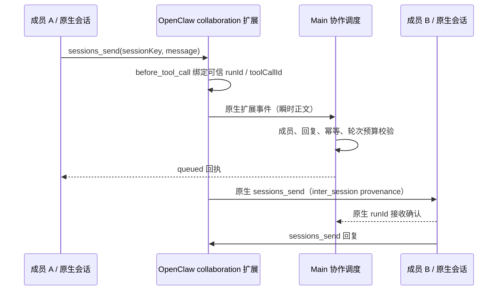
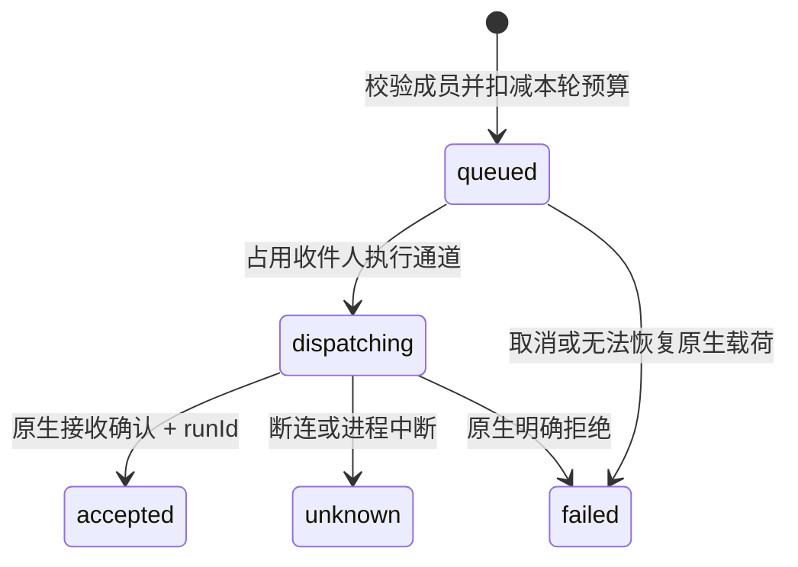

# 平级 Multi-Agent 协作设计

> 下一阶段以 [一条用户会话下的多助手协作](task-scoped-agent-collaboration.md) 为目标设计：任务专属会话、原生 sessions_send 与产品归属管理。该方案尚未替换当前实现；本文保留现有实现及早期设计记录，涉及固定成员和自定义通信的描述不作为下一阶段目标。

状态：首版已接通并完成真实 Gateway 的双向投递验证。独立助手档案、手动交接与 Subagent 继续保留，语义与平级协作分开。

## 1. 产品语义

一个协作会话是工作空间容器。每名成员是已配置的持久 Agent，在容器中拥有唯一、独立的 OpenClaw 原生 session。成员没有父子执行关系，默认助手只是用户消息的默认收件人，不拥有其他成员的生命周期。sessions_spawn 继续表示成员自己的子任务，不加入平级成员图。

用户在主会话提出任务，主 Agent 可按任务安排成员协作。主 Agent 先通过 `task_assistants` 准备成员会话，成员再通过 OpenClaw 原生 `sessions_send` 定向发送消息；接收者独立执行并可以向任意同房间成员回复。模型不能自行扩大成员名单，也不能修改成员权限。正文、工具调用和回复只存在 OpenClaw 原生历史中。

## 2. 简洁界面

沿用会话列表，一间协作空间只显示一行。通过现有会话菜单的“协作成员”管理 2–6 名助手，不新增常驻工具栏按钮。普通单助手会话保持现状。初版创建时选择固定成员，暂不提供运行中的增删成员操作。

主会话及输入框保持固定。头部“协作 · 人数”或会话菜单打开右侧现有标签栏中的“协作”页，展示图和消息事件列表；只有实际投递才出现连线。现有列表入口增加“协作成员”分区，仅显示助手与职责，真正的 Subagent 仍单独展示。点击成员或图节点在协作页查看独立、只读的原生聊天记录，不切换主会话；通过返回入口回到流程图。

图：节点是平级成员，有向边是实际消息，双向消息分别计数。未发消息的成员也显示节点。点击节点查看成员，点击任一方向的边进入两个成员的完整往来；列表按时间排序，显示时刻、回复标识和经原生 receipt 精确查询的正文。点击消息在协作页打开收件人的原生消息详情；不复制正文到产品数据库。Subagent 单独留在原有子任务列表。

## 3. 标识与所有权

- roomId：产品协作空间稳定标识。
- memberId：空间内成员，关联 agentId、productSessionId 和 nativeSessionKey。
- messageId：幂等消息标识，由主进程分配，并按可信源 run 和 toolCallId 幂等关联；不能仅信任模型生成的来源。
- inReplyTo：可选回复引用，必须属于本空间且原消息的收件人等于当前发送人。
- runId：OpenClaw 确认后的原生执行标识；初版不保存 transcriptEntryId。

产品数据库只存空间、成员与路由元数据，不缓存正文。消息权威是原生 transcript 中的工具调用和收件人输入溯源；重启从路由元数据恢复图。查看关系时，Main 先用房间元数据限定 delivery id，扩展再通过 OpenClaw 的 idempotency 索引定位 receipt，并用 `chat.message.get` 复核当前可见分支和 provenance，不扫描无关历史。图不能根据模型文字中“已发送”或预计调用构造成功边。

## 4. 执行与权限

随应用分发的 OpenClaw 扩展提供 `task_assistants`，负责列出助手并为当前任务准备目标成员会话。消息投递复用原生 `sessions_send`；扩展 hook 从 `ctx.sessionKey` 取得发送人，Main 校验房间成员、原生运行身份和目标会话，禁止伪造来源、跨任务发送、给未启用或已退出成员发送。

成员 session 初始化复用现有执行准备路径，应用模型、权限、工作目录与计划模式。不能直接绕过适配器调用 chat.send 来规避审批。原生执行仍由 OpenClaw 所有。

发送是异步投递，不等待对方完整执行结束，避免 A 等 B、B 等 A 的死锁。消息状态严格区分 queued、accepted、failed；accepted 只表示原生接收确认，不表示任务完成或对方已理解。只有真实后续回复建立回复关联。

不扩大 tools.sessions.visibility，不全局开启不受限的 agentToAgent，不用提示词代替房间隔离。计划模式禁止协作发送等执行行为，保持现有只读约束。

## 5. 有界调度与故障

同一收件人串行，不抢占正在执行的用户任务。每次用户发起协作轮次最多 16 次成员间投递，超过后停止自动传播并显示原因；用户继续才开始新轮次。预算和消息标识持久化，重启不重置预算。停止空间时停止调度并取消活动执行；未确认消息不得标为成功。

相同调用重试返回同一投递结果，不重复执行。原生接收后断连属于确认未知；初版保留未知状态，不自动核对或盲目重发。重启后恢复空间成员与投递元数据。删除单个成员会话时明确解除成员关系，不能留下可以被旧调用寻址的成员。

## 6. Agent 文件与项目文件

AGENTS.md、SOUL.md、IDENTITY.md 归 Agent 的独立原生 workspace，成员共用同一 Agent 身份时不再复制这些文件到项目根目录。项目目录是任务资产目录；成员身份目录与项目目录是两种不同用途。

初版成员可共享项目工作目录，因此不同成员修改同一文件可能冲突。运行指令要求明确文件负责范围；代码任务以后可增加每成员 worktree，但不在初版自动创建多个仓库或自动合并。全局 Agent 文件修改沿用当前空闲检查，避免运行中替换身份。

## 7. 实施顺序与验收

1. 先固定共享协议、成员验证、幂等与消息状态规则；测试越权、伪造来源、重复发送、非法回复和预算。
2. 实现空间与成员生命周期、原生扩展和现有执行适配器之间的受约束投递；测试双向和第三成员消息，确认无父子 spawn 关系。
3. 接入现有会话菜单、成员聊天切换和协作图；图消费真实投递记录，展示失败和空房间。
4. 使用隔离数据目录和重新装配的锁定运行时验证：用户 → A，A → B，B → A/B → C。关闭重开后成员与记录一致；普通会话、子任务、审批和计划模式不回归。

验收必须区分真实 Gateway 验证与模拟测试。未接通原生扩展前不能宣称已支持自动平级协作；没有真实消息时不能用演示连线冒充运行结果。

## 8. 当前实现检查点

已接通以下执行链路：

扩展的 hook 与工具工厂可能由不同注册实例创建，因此不能依赖它们共享闭包。
可信调用绑定与待处理请求由原生 Gateway 方法集中管理，绑定有有效期且消费一次。
模型不能传入 from、sessionKey 或 sourceRunId。原生消息使用 `inter_session` 溯源，
内部通道为 OpenClaw 的 `webchat`，不会创建 Subagent 或扩大原生跨会话可见范围。

主进程复用执行适配器的准备、权限、取消与 run 跟踪；收件人忙碌时串行排队。
停止操作冻结已有用户轮次并停止所有成员，晚到的工具事件不能重启旧轮次。
消息正文只在瞬时事件、内存队列和原生历史中存在。重启后无法恢复的 queued
变为 failed，未确认的 dispatching 变为 unknown，均不自动重发。

界面已挂载：会话菜单 → 协作成员；创建后侧栏仅显示空间锚点一行。
右侧“协作”标签展示流程图；点节点和消息行打开对应成员的原生只读详情，
主聊天及输入收件人保持不变。箭头、计数、时刻、回复标记及接收状态组成事件视图。
协作消息依可信原生 provenance 标注来源，并隐藏精确匹配的内部投递前缀；
只改变显示，不修改原始历史，也不隐藏用户输入的相似内容。

验证：锁定 OpenClaw 2026.9.2 运行时从 pristine 包重建，在隔离 Electron 数据目录中，
用本地确定性模型驱动真实 Gateway 完成用户 → A → B → A；两次投递均收到原生
runId，回复引用正确且继承同一轮预算。该验证使用真实工具、事件、执行与存储，
模型本身是本地测试服务，不能替代远端真实模型的自主任务质量验证。

当前限制：2–6 名固定成员；成员共享项目文件时仍可能写冲突；未知接收不自动对账；
消息行定位到成员会话，尚不精确滚动到 transcript entry；图表达投递与回复关系，
不把 accepted 表示成整个任务完成。

## 9. 手动试用

1. 在“我的 Agent…”配置至少两名已启用助手及可用模型。
2. 打开一个空闲的本地会话，从现有会话菜单选择“协作成员”，勾选成员后创建。
3. 在当前成员输入任务，例如“请把实现交给开发助手，把结果交给审查助手，双方直接交换问题和结果”。
4. 点击头部“协作 · 人数”打开右侧协作页，点击图节点查看助手详情，返回可继续查看流程。主会话保持不变。
5. 在面板点击“停止整个协作”取消该轮；新一条用户消息可开启下一轮。

开发预览必须使用重新装配、包含 collaboration 扩展的运行时。仅启动 Vite 不会
替换已加载的 Gateway 扩展；更新扩展后需要彻底重启隔离 Gateway/Electron。

accepted 不等于完成；是否有回复由另一条真实消息及其 inReplyTo 表达。

## 2026-09-19 并行审查修复

执行、界面、消息渲染分别审查，再交叉复核修改：

- 接收方在 RPC 确认到达前调用协作工具时，以原生绑定的接收 Agent 与 runId 确认接收，允许真实回复关联原消息；不能由消息正文伪造。
- 队列发送前及异步状态查询后重新校验房间、双方成员、会话、启用状态和停止状态。失效的待发送消息结束为 failed；原生明确拒绝与传输结果不确定分别为 failed 和 unknown，已确认接收的消息不回退。
- 成员详情复用 ChatController 与 ChatMessageDisplay，按普通原生会话加载，避免 Subagent 任务边界裁剪。已有消息不会被执行错误隐藏；冷启动采用有界重试，Gateway 重启后刷新连接，每轮加载均有超时与卸载清理。
- 消息来源使用可信 provenance 中的 Agent 身份，避免不同成员消息被合并；正文不能覆盖来源。
- 搜索命中成员会话时，保留主会话并打开协作详情。连续导航仅最新请求可以打开详情。批量选择、计数及删除只针对当前可见会话。

回归覆盖执行确认竞态、成员失效、明确拒绝与不确定结果、原生来源识别、消息去重、详情连接生命周期、图结构和搜索入口。未增加额外操作按钮。
