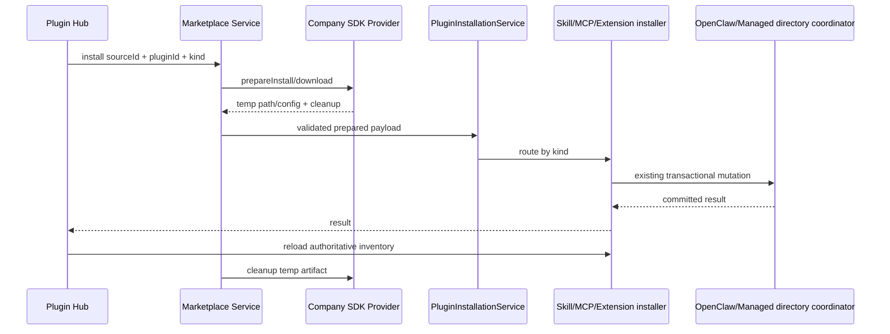

# Plugin Hub 体验与管理模型改造方案

> 状态：主体已实施。统一页面、简化分组、action capability、空查询推荐、最小 Provider
> 降级和安装串行化已经落地；完整 shadowed Skill 视图仍等待 additive Gateway contract。
> 本地导入和市场下载的 Extension 已共用格式判断与转换入口；原生包直接进入 OpenClaw，
> 异构包的转换尚未实现，当前提示后停止安装。来源与兼容程度标记留作后续独立设计。
>
> 本文以 JustDo 分支 `feat/plugin-hub-ui` 的 `3405e69de` 为产品基线，以相邻
> `../openclaw` 的 `v2026.9.2`、commit
> `3928bad9badfcb6c7d140530435e806fb8092190` 为运行时语义基线。本文描述目标方案，
> 不表示相关 contract、IPC 或 UI 已经实现。

## 1. 结论

插件页继续保留一个入口、一个页面，但不再把 Extension、Skill、MCP、Hook 的底层来源
直接做成多层分组。普通用户只需要理解三件事：它能做什么、现在能不能用、自己能做什么。

本轮设计采用以下决策：

1. “已安装”和“市场”不再是两个页面。空搜索展示推荐和已安装能力；有关键词时，把本地
   与市场结果合并到同一结果区。
2. Extension、Skill、MCP、Hook 是筛选条件，不是四套不同的信息架构。
3. 系统、组织、个人、项目、扩展提供是管理属性，只在影响理解或操作时显示为徽标，
   不作为默认分组。
4. Renderer 不根据来源猜权限。Main 为每个条目返回可执行动作和不可执行原因，并在写操作
   时再次校验。
5. 同名 Skill 默认只展示 OpenClaw 判定的有效项。关闭开关表达“关闭当前这个 Skill”，
   不在主列表提供“关闭某个来源层”的歧义操作。
6. 推荐只使用市场可提供的公开目录信号。第一阶段展示“热门推荐”或“精选”，不宣称
   “猜你喜欢”，不读取对话、任务内容或用户行为画像。
7. 企业市场仍只支持 Skill、MCP、Extension 三种安装 kind，Hook 不进入市场。Claude Code、
   Codex、Cursor 等异构 Extension 包进入共用转换分支，转换实现前停止安装；来源和兼容程度标记留作后续设计。
8. 页面改造不能绕过现有安装器、目录锁协调器、事务删除和安装后权威重查。

## 2. 问题与设计目标

### 2.1 当前问题

- 页面虽然已经把市场嵌入各类型管理页，但用户仍需要先选择类型，再理解各类型自己的
  分组、开关和安装方式。
- Skill 把 workspace、project、personal、managed、bundled、extra、unknown 全部展示出来，
  暴露了运行时加载细节。
- Extension、Skill、MCP、Hook 对“系统管理”“扩展提供”“不可关闭”的表达不一致；有些
  页面用禁用开关，有些页面隐藏操作，有些只靠来源推断。
- 已安装列表较长时，市场内容位于整段列表之后，发现能力的入口仍然难以到达。
- 同名 Skill 的来源优先级、有效项和禁用语义容易被误解为“系统自动重新启用了另一个”。
- 公司 SDK 只有搜索和按 ID 下载，不能依赖图标、详情、安全评分、评论或个性化推荐接口。

### 2.2 目标

- 新用户不学习 OpenClaw 目录结构也能安装、启停、配置和删除能力。
- 高级用户仍能在详情中看到来源、路径、提供者和覆盖关系。
- 所有权限展示来自后端事实；无权操作不会通过伪开关制造误导。
- 市场 Provider 保持 Main-only、最小、可替换，内网接入不修改 Renderer。
- 安装、更新、删除的目录安全性不低于当前实现。

### 2.3 非目标

- 不在本轮定义 Claude Code、Codex、Cursor 等异构插件包的兼容等级和能力标记。
- 不为内网市场增加 ClawHub 的安全评分、评论、签名审查或详情 token 协议。
- 不使用对话内容、文件内容或任务历史训练或计算推荐。
- 不在 Renderer 重新实现 OpenClaw 的 Skill 加载优先级。
- 不通过扫描文件目录伪造 Gateway 没有返回的运行时状态。

## 3. 竞品原则与本项目取舍

ChatGPT 当前以插件包作为用户一级对象；Skill、MCP 和 Hook 是包内能力。目录使用 OpenAI、
工作空间、个人和已安装等少量入口，不能卸载的默认或工作空间插件不提供卸载动作。参考
[OpenAI Plugin 文档](https://learn.chatgpt.com/docs/plugins)。

JustDo 不照搬其“已安装”独立入口，因为本项目最初的问题正是两个页面割裂。保留的是三个
产品原则：

- 包或能力是一级对象，来源是二级信息；
- 不可操作状态由管理方和策略解释，不把技术层级变成导航；
- 详情按需展开，首页只服务发现和高频管理。

## 4. OpenClaw 事实基线

### 4.1 Skill 来源与优先级

`../openclaw/src/skills/loading/workspace-skill-loader.ts` 依次合并：

```text
openclaw-extra
  < openclaw-bundled / openclaw-custodian
  < openclaw-managed
  < agents-skills-personal
  < agents-skills-project
  < openclaw-workspace
```

后写入的同名记录覆盖先写入记录。碰撞键是精确的 `skill.name`，不是展示名称的模糊匹配。
同一规范路径通过多个 root 被发现时不会被当作两个版本。

### 4.2 当前禁用与同名项语义

当前实现有三个直接影响 UI 的事实：

1. `workspace-skill-loader.ts` 在检查 enabled、allowlist 和 requirements 之前，已经用
   `Map<skill.name, record>` 丢弃低优先级同名项。
2. `src/skills/discovery/status.ts` 的 `skills.status` 使用上述合并结果，因此只返回当前赢家，
   不返回 shadowed variants。
3. `src/skills/config/mutations.ts` 的 `skills.update` 写入
   `skills.entries[skillKey].enabled`；`skillKey` 来自 metadata，缺失时使用 Skill name。

因此，对这份源码而言，仅把当前赢家设为 disabled 不应令低优先级同名项自动变成赢家；
disabled 判断发生在合并之后。赢家目录被删除、移动、变得不可发现，或请求切换到另一个
workspace 时，低优先级项才可能在下一次加载中成为赢家。

用户报告的“禁用某一层后另一层自动启用”必须在实施前用实际打包 runtime 复现。可能原因
包括内网 OpenClaw 有额外修改、用户动作实际删除/移动了目录、workspace 发生切换，或
`skillKey` 与 name 的配置行为不同。不能仅根据现象修改 Renderer 文案。

### 4.3 当前 API 缺口

现有 `skills.status/update` 无法权威完成以下 UI：

- 显示“另有 2 个同名版本”；
- 列出每个 shadowed variant 的路径和状态；
- 预告停用某个 variant 后会切换到哪一个；
- 单独启停被覆盖的 variant。

如果确实需要这些能力，应向锁定的 OpenClaw 版本增加 additive Gateway contract，让加载器
返回候选集合与解析结果；不能让 `openclawSkillFiles.ts` 升格为 metadata authority。

## 5. 页面信息架构

### 5.1 单页结构

```text
┌──────────────────────────────────────────────────────────────┐
│ 插件                                                         │
│ 扩展 Agent 的工作流、工具和连接                              │
│ [搜索已安装和市场……………………]                              │
│ [扩展] [Skill] [MCP] [Hook]                                  │
├──────────────────────────────────────────────────────────────┤
│ 用户安装                                      [导入]          │
│ [卡片] [卡片] [卡片] ...                                    │
├──────────────────────────────────────────────────────────────┤
│ 系统与内置（默认折叠）                                  [>]  │
├──────────────────────────────────────────────────────────────┤
│ 热门推荐（无搜索词且 Provider 支持时，紧凑单行）             │
│ [卡片] [卡片] [卡片] [卡片] →                               │
└──────────────────────────────────────────────────────────────┘
```

工具栏在滚动后保持 sticky。类型使用紧凑 filter chips，不再使用占据首屏的大型导航卡，
不增加“全部类型”或状态标签页。导入动作位于“用户安装”标题行，不单独占据一行。

### 5.2 搜索行为

- 输入为空：依次展示用户安装、折叠的系统与内置，以及 Provider 支持时的一行推荐。
- 输入非空：同时过滤本地条目并调用 Marketplace search，结果进入同一个区域。
- 已确认是同一个安装对象的目录项和本地项合成一张卡；不能确认时宁可显示两张，也不能按
  名称模糊合并。
- Marketplace 失败不影响本地搜索。Gateway 离线不影响目录搜索，但安装按钮说明运行时
  当前不可用。
- 保持 Provider 分页顺序；Renderer 不跨页按下载量重新排序。

### 5.3 卡片信息

每张卡最多展示：

- 稳定图标或由 `kind + id` 生成的彩色占位图；
- 名称、两行描述和类型徽标；
- 一个主状态：可安装、已启用、已关闭、需要配置、不可用、更新可用；
- 必要时一个管理徽标：系统管理、组织提供、当前项目、由某扩展提供；
- 一个主动作和一个更多菜单。

普通来源不反复展示。“个人安装”只有在与系统/项目同名、影响删除范围或帮助理解来源时
才出现。

已安装列表不把 OpenClaw 的每一种来源层级直接变成一级分组。默认只分为“用户安装”和
“系统与内置”：用户内容排在前面并展开，系统内容排在后面并折叠。搜索时自动展开命中的
系统组。项目、个人、扩展提供等精确来源继续以必要的轻量徽标和详情信息表达，避免把运行
时优先级模型强加给普通用户。

“已安装”不再作为这两个分组的父标题，避免形成没有实际导航作用的重复层级。页面内容区
直接使用“用户安装”“系统与内置”“热门推荐”三个同级区块；导入、新增和批量检查等本地
管理动作归入“用户安装”标题行。

### 5.4 动作展示规则

- 可以操作：显示正常按钮或 switch。
- 启用和关闭使用相同尺寸的紧凑线框状态动作，分别以绿色和暖橙色区分，不铺设彩色背景；
  加载状态只显示“正在应用”，不能在后端尚未返回前假定 AI 引擎一定会重启。
- 市场返回 `update-available` 时使用橙色向上更新图标；是否可更新仍由运行时安装清单与
  Provider 状态共同判断，不能只相信目录中的安装状态。
- 因暂时状态不能操作，例如 Gateway 离线或安装中：保留动作但 disabled，并显示原因。
- 因永久策略不能操作：不显示假的 disabled switch，改成锁图标和“由系统管理”；删除动作
  从菜单移除，详情中保留管理原因。
- 子能力由 Extension 管理：显示“由 {extensionName} 提供”，点击进入父 Extension 详情；
  不允许在子项上产生一份相互冲突的配置。

### 5.5 详情面板

详情使用模态详情面板而不是新的管理页面，按可用数据渐进展示：

1. 概览：描述、版本、作者、类型、来源；
2. 状态：configured state、effective state、缺失要求和错误；
3. 包含能力：Extension 已知的 Skill/MCP/Hook；
4. 配置与连接；
5. 高级信息：runtime id、market source、路径、原始来源值；
6. 危险操作：仅在后端允许时显示删除。

详情中的插件描述和市场 README 使用现有的安全 Markdown 管线渲染；列表卡片继续使用纯文本
摘要，避免富文本撑高卡片或在卡片交互区产生链接嵌套。

只有基础元信息且没有 `getDetail` 的市场项不打开空详情面板；卡片保留直接安装动作。

## 6. 统一展示模型

底层领域 contract 和 manager 继续分开，不创建统一 `PluginHubItem` 或第二份持久化权威。
各领域 DTO 只复用以下展示语义：

```ts
type PluginHubScope = 'system' | 'organization' | 'personal' | 'project' | 'extension' | 'other';

type PluginActionReason =
  | 'managed-by-system'
  | 'managed-by-organization'
  | 'managed-by-extension'
  | 'gateway-offline'
  | 'requirements-missing'
  | 'read-only-source'
  | 'not-installed'
  | 'unsupported';

interface PluginActionCapability {
  allowed: boolean;
  reason?: PluginActionReason;
  managedById?: string;
  managedByName?: string;
}

interface PluginManagementCapabilities {
  enable: PluginActionCapability;
  disable: PluginActionCapability;
  remove: PluginActionCapability;
  configure: PluginActionCapability;
  revealInFolder: PluginActionCapability;
}

```

列表 key 只用于一次 Renderer snapshot。持久身份分别使用 runtime identity 和
`sourceId + pluginId + kind`；不得用 name 对账市场安装状态。同一 Marketplace identity 的
install/update 在 Main 串行，Renderer 的按钮防重只负责即时反馈。

`configuredEnabled` 与 `effectiveState` 必须分开：一个 MCP 可以配置为 enabled 但连接失败；
一个 Skill 可以配置为 enabled 但缺少 bin；一个 Extension 可以 enabled 但加载 error。

## 7. 来源归一化与权限

### 7.1 用户可见来源

| 原始事实                                      | 默认展示      | 说明                         |
| --------------------------------------------- | ------------- | ---------------------------- |
| `openclaw-bundled`、`openclaw-custodian`      | 系统提供      | 不等于一定禁止关闭           |
| `openclaw-managed`、`agents-skills-personal`  | 我的          | 通常可删除，仍以 action 为准 |
| `agents-skills-project`、`openclaw-workspace` | 当前项目      | 只对当前 workspace 有效      |
| 普通 `openclaw-extra` 目录                    | 其他来源      | 详情展示；不能推断所有权     |
| 生成的 `plugin-skills` 中的 Skill 与 Extension-provided MCP/Hook | 插件托管 | 由父插件管理 |
| Gateway `managed` 或产品保护清单              | 系统管理      | 不能关闭或删除               |
| 企业 Provider 安装且 runtime 已确认           | 我的/组织提供 | 由 Provider policy 决定      |

JustDo 当前 `OpenClawSkillSource` 尚未包含 `openclaw-custodian`。实施时必须扩展兼容映射，
未知的新 source 要降级到 `other`，不能令整个列表解析失败。

### 7.2 权限来源

权限必须由 Main 汇总并在 mutation handler 重查：

- Extension：以 Gateway `canToggle`、`removable`、`mutationAllowed` 和 JustDo managed ID
  为权威；bundled 不是禁止关闭的充分条件，例如 Workboard 可以关闭。
- Skill：Gateway 负责 enabled/eligible；JustDo 的受保护内置 Skill 必须在 manifest 中显式
  声明 action policy，不能根据 bundled 一刀切。当前 manifest 没有该字段，实施时按需增加。
- MCP：用户记录可以编辑、启停、删除；Extension-provided 项只读并跳转父 Extension。
  当前 `isBuiltIn` 表示从内置 registry 安装，不等于系统强制，不能用它自动锁定。
- Hook：plugin-managed 项由父 Extension 管理；用户 managed Hook 可删除；bundled Hook
  是否可关闭由明确 policy 决定。

建议 manifest policy 只描述产品真正拥有的限制：

```json
{
  "id": "required-skill",
  "enabled": true,
  "management": {
    "allowDisable": false,
    "allowRemove": false,
    "reason": "required-by-product"
  }
}
```

Renderer 只消费合并后的 capabilities，不直接读取这个 manifest。

## 8. 同名 Skill 设计

### 8.1 主列表

主列表按 OpenClaw 返回的有效 Skill 一项一卡，不再按来源分组。卡片可以显示“当前项目”或
“系统提供”徽标，但不能在没有权威候选数据时显示“另有 N 个版本”。

开关文案表示启停当前逻辑 Skill，而不是“启停当前目录层”。第一阶段不提供 variant-level
toggle。这样用户不会因为关闭一个看似独立的层级而意外触发另一个层级。

### 8.2 mutation 后解析变化

所有 Skill 写操作完成后重新调用 `skills.status`，比较操作前后的：

```text
name + skillKey + source + canonical baseDir + disabled + eligible
```

如果同名项的 source/baseDir 改变，成功提示必须描述解析变化：

```text
“代码审查”的当前来源已从“当前项目”切换为“我的”。
```

不能提示“另一个版本已自动启用”，因为低层项可能一直处于可发现状态；准确说法是“当前
使用来源发生变化”。如果条目完全消失，则提示“该 Skill 当前不可用”。

### 8.3 实施前契约测试

在修改 UI 前，必须针对实际打包 runtime 覆盖以下 fixture：

1. 六个来源存在完全相同 `name`，确认赢家顺序；
2. 同名同 `skillKey`，调用 `skills.update(enabled=false/true)`；
3. 同名不同 metadata `skillKey`，分别调用 update；
4. 删除赢家目录后刷新；
5. workspace 切换；
6. Gateway 热刷新和新 session 是否一致。

预期基线是：简单 disable 不回退，删除/不可发现会回退。如果内网 runtime 与此不同，先把
差异固化成 OpenClaw patch test，再决定产品语义，不能只在 JustDo 测试里 mock。

### 8.4 完整版本管理的后续 contract

如果产品确定要让用户查看或选择所有同名版本，则必须先扩展 Gateway，例如给
`skills.status` 增加可选 `includeShadowed`，返回：

```ts
interface SkillResolutionGroup {
  name: string;
  effectiveVariantId?: string;
  variants: Array<{
    variantId: string;
    skillKey: string;
    source: string;
    filePath: string;
    baseDir: string;
    precedence: number;
    resolution: 'effective' | 'shadowed' | 'disabled' | 'ineligible';
  }>;
}
```

该 contract 必须由 loader 在丢弃碰撞项之前生成。届时详情抽屉可以显示“当前使用”和
“已启用但被覆盖”，并在删除当前版本前预告下一赢家。仍不建议提供逐层 toggle；如果未来
必须提供，需要 OpenClaw 同时定义 name-level disable 与 variant-level disable 的持久化
语义，不能用多次 `skills.update` 拼出可能半成功的事务。

## 9. 推荐内容

### 9.1 第一阶段数据来源

保持当前最小 Provider contract。搜索框为空时调用同一个 `search`：

- SDK 支持空关键词：Provider 原样映射结果顺序，可使用服务端下载量排序；
- SDK 不支持空关键词：Provider 返回空结果，UI 保留“热门推荐”标题并显示空状态；
- 内网以后有运营精选：Provider 把空查询映射到精选列表，通用层无需变化。

UI 标题根据 Provider 能证明的信号使用“热门推荐”或“精选”，不使用“为你推荐”。下载量
可以展示，但 Renderer 不根据单页数据伪造全站排名。

### 9.2 不采用的方案

- 不从用户聊天关键词推断推荐；
- 不上传已安装列表换取个性化结果；
- 不把本地搜索点击和安装历史做隐式画像；
- 不在无法枚举整个市场时用客户端公式声称“Top”；
- 不硬编码一组无法由 SDK 查询和验证的推荐 ID。

未来如果 SDK 增加专门推荐接口，可以给 Provider 增加可选 `recommend`，但在真实需求出现
前不扩大 shared/IPC contract。

## 10. 企业 Marketplace 适配

### 10.1 保持的通用接口

```ts
interface PluginMarketplaceProvider {
  readonly source: MarketplaceSource;
  search(query: MarketplaceQuery): Promise<MarketplaceSearchResult>;
  getDetail?(request: MarketplaceDetailRequest): Promise<MarketplacePluginDetail | null>;
  prepareInstall(request: MarketplaceInstallRequest): Promise<PreparedMarketplaceInstall>;
}
```

内网 Provider 只负责：

- 把 SDK 元信息映射为公共字段；
- 用 SDK 按 ID 下载到临时目录；
- 为 Extension/Skill 返回 `sourcePath`，为 MCP 返回结构化配置；
- 提供仅针对该临时产物的 cleanup。

SDK 对象、认证、内网 URL、临时目录实现和原始响应不能穿过 preload。Provider 不需要补齐
图标或详情；缺失字段由 UI 降级。

### 10.2 格式边界

企业来源只声明 `extension | skill | mcp`：

- Skill 进入现有 Skill 导入事务；
- MCP 映射为 JustDo/OpenClaw 支持的 server config；
- Extension 经共用 `extensionConversion.prepareExtensionForInstall` 入口判断格式；存在
  `openclaw.plugin.json` 时原样放行，最终 manifest 与能力校验由 OpenClaw 负责；
- OpenClaw 当前支持 Claude Code、Codex、Cursor 等 bundle/plugin 格式，但应用将非原生包
  统一送入转换分支；转换暂未实现，当前提示并停止安装，不生成适配文件或执行安装器；
- 后续单独设计来源厂商与兼容程度标记，区分原生、兼容和部分兼容，并在有权威转换报告时
  展示未映射能力；在该 contract 落地前不猜测、不承诺具体兼容范围；
- Hook 不属于当前企业 Marketplace kind。

## 11. 安装与目录安全不变量

页面重构只改变发现和呈现，不改变目录 mutation owner：



必须保留：

- 安装、更新、删除继续通过现有 domain service；Renderer 不接触文件系统。
- Windows EACCES、EPERM、EBUSY 使用 `ManagedDirectoryOperationCoordinator` 的 preflight、
  owner 检测、受管 Gateway stop/retry/start 和有界重试。
- 不得为了重试先删除 live target；不得在状态不确定时重复卸载。
- 删除仍使用事务目录/权威 inventory 判断提交状态；cleanup 失败不能删除 live install。
- Provider cleanup 只能针对 Provider 返回的临时产物，并在成功、失败两条路径运行。
- 安装按钮必须防重复提交；同一 identity 的 install/update 串行化。
- UI 只在目标 runtime inventory 重查成功后显示“已安装”。

涉及安装流程的实现提交必须回归现有 directory lock、external owner、runtime restart、trash
cleanup 和“已提交后不重复删除”测试。

## 12. 状态、错误和可访问性

- skeleton 容器使用 `aria-busy`；加载提示使用 `role=status`、`aria-live=polite` 和屏幕阅读器
  文本。
- switch 使用原生 button/switch 语义，支持键盘，包含当前状态和管理原因。
- 安装/更新成功后通过 live region 宣布，并保留可见结果提示。
- 下载量使用应用当前语言创建 `Intl.NumberFormat`，不能跟随操作系统语言漂移。
- 长列表使用 sticky 工具栏；推荐最多一行，不能把管理区推到不可达位置。
- 错误按 source 隔离：一个 Provider 失败不清空其他 Provider 或本地 inventory。

## 13. 实施分解

### Phase 0：固化事实

1. 在锁定 OpenClaw runtime 上增加同名 Skill 契约测试。
2. 用锁定打包 Runtime 对比同名 Skill 的 precedence、配置禁用、目录移除和 workspace
   切换结果；内网 runtime 差异在实际接入时另做验收。
3. 确认哪些 Skill、MCP、Hook 是产品强制，形成显式 policy 清单。

完成条件：同名禁用/删除/切换 workspace 的行为有锁定打包 Runtime contract，不依赖 UI mock。

当前仓库使用锁定的 `vendor/openclaw-runtime/current/openclaw.mjs` 做 CLI contract，已经覆盖
workspace > managed > bundled、逻辑禁用不切换赢家、赢家目录消失后回退，以及 workspace
切换。完整 shadowed variant 枚举和逐版本操作仍不属于当前 Gateway contract。

### Phase 1：权限 contract

1. 在各领域 DTO 增加统一 action capability 和稳定 reason code。
2. Extension 直接映射 Gateway 权限；Skill/MCP/Hook 在 Main 汇总产品 policy。
3. 所有 IPC mutation 在 Main 重查 action，不信任 Renderer 参数。
4. 扩展 Skill source union，兼容 `openclaw-custodian` 和未知 future source。

完成条件：受管项既不能从 UI 操作，也不能绕过 UI 调 IPC 操作。

### Phase 2：统一页面

1. 用 sticky 搜索和 Extension/Skill/MCP/Hook 紧凑类型选择替代大型导航卡；按后续产品决策
   不再显示“全部类型”以及“全部/已安装/可安装”状态筛选。
2. 各 kind 保留自己的运行时 DTO 和 manager，复用 shared action capability、分组、状态动作与
   artwork，不新增统一持久化缓存或伪造第二份权威。
3. 当前类型内共享搜索本地和市场；内容顺序固定为“用户安装”“系统与内置”“热门推荐”，
   详情使用模态面板。
4. Skill 来源归并为用户和系统两组，精确来源只作为 badge/detail；系统组默认折叠，搜索命中
   时临时展开。
5. 统一 card、empty/error/loading、管理锁和 responsive 行为。

完成条件：安装、管理、搜索不发生路由切换；推荐保持紧凑单行且不制造新的页面层级。

### Phase 3：推荐与 Marketplace 收口

1. 保持空查询推荐约定和 Provider 顺序。
2. 验证无 icon、无 detail、无推荐三种最小 SDK 降级路径。
3. Extension 安装共用格式判断与转换入口，原生包直通，异构包在转换实现前停止安装；来源和兼容程度标记留作后续独立方案。
4. 安装完成后按 runtime identity 合并本地与目录卡片。

完成条件：只实现 search/download 的 Provider 可以不修改 Renderer 完整接入。

### Phase 4：同名版本高级视图（需要时）

只有 Phase 0 证明业务确实需要逐版本解释时才实施 additive OpenClaw contract。JustDo 只消费
Gateway 返回的 variants/resolution，不扫描目录推断。没有该 contract 时保持单有效项 UI。

## 14. 测试与验收

### 14.1 单元与 contract

- 原始 source 到简化 scope 的完整映射和 unknown 降级；
- action capability 与 reason code 的 Main 投影；
- 系统强制 Extension/Skill/MCP/Hook 的 mutation 拒绝；
- configured/effective/install state 的卡片优先级；
- runtimeId 对账，不按名称误合并同名市场项；
- 最小 Provider：无 icon、无 detail、空查询返回空；
- Provider 搜索顺序和分页保持；
- 安装成功/失败均执行 temp cleanup；
- 同名 Skill 的锁定 Runtime precedence、配置禁用、目录移除与 workspace 切换测试。

### 14.2 Renderer

- 默认页同时可到达推荐和已安装内容；
- kind/search 组合过滤；
- 每个 kind 的已安装与市场内容共存；
- managed item 显示锁说明且没有可点击假开关；
- extension-provided 子项跳转父 Extension；
- loading、error、empty 和 offline 的键盘/屏幕阅读器行为；
- 应用语言控制下载量格式；
- mutation 后 identity 改变时显示“当前来源已切换”。

### 14.3 安装安全回归

- Windows lock preflight；
- 仅受管 Gateway 持锁时 stop/retry/start；
- 外部进程持锁时报告 owner 且不破坏目录；
- Gateway 已提交删除后不重复卸载；
- trash rollback/cleanup；
- Provider 临时目录 cleanup 不触碰 live target；
- 重复点击和并发安装幂等或明确冲突。

### 14.4 产品验收

- 普通用户完成“搜索 → 安装 → 启用/配置”不需要理解 source 层级。
- 普通用户完成“找到已安装项 → 关闭/删除”不需要切换页面。
- 不可关闭项明确显示管理方和原因。
- 搜索失败不影响管理已安装项；Gateway 离线不清空市场结果。
- 没有推荐数据时页面自然降级，不显示假的推荐或空白大区块。
- 没有权威 variants 数据时不宣称存在几个同名版本。

## 15. 需要在实施 PR 中同步更新的文档

- `docs/architecture/07-plugin-system.md`：把完成后的权限 contract、UI 数据流和 Skill
  解析行为从“计划”更新为“现状”。
- `docs/architecture/16-skill-marketplace-adapter.md`：同步 Provider 的最终推荐约定与异构插件
  兼容标记后续决策。
- `docs/architecture/openclaw-gateway-capability-matrix.md`：若增加 shadowed Skill Gateway
  contract，记录 owner、patch 和测试。
- `scripts/patches/v2026.9.2/README.md`：只有实际新增 OpenClaw patch 时更新。
